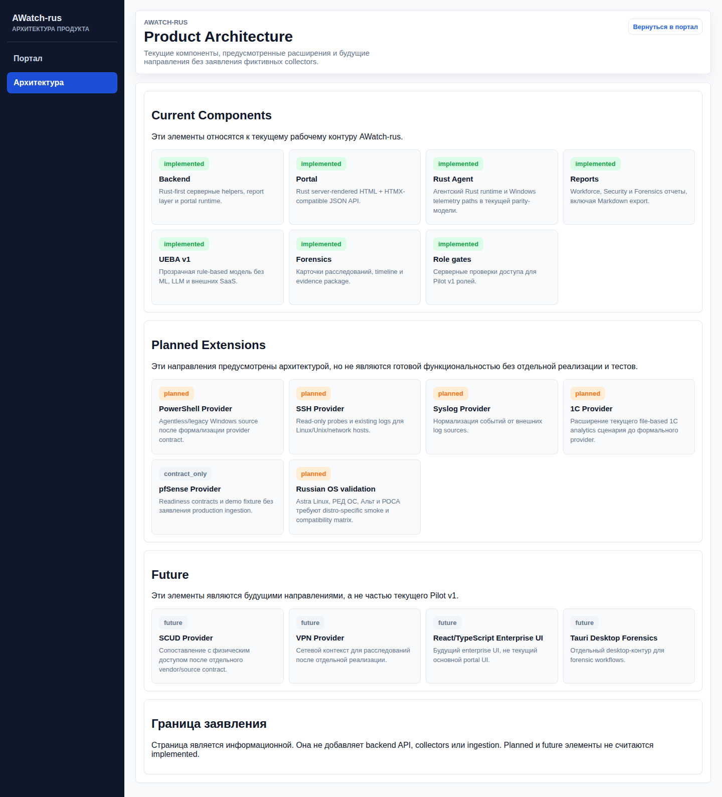

# AWatch-rus

AWatch-rus - программный комплекс операционного контроля,
технического аудита, оценки трудоотдачи сотрудников и мониторинга
корпоративной ИТ-инфраструктуры на базе ActivityWatch, Rust-сервисов
автоматизации, Grafana/Prometheus-витрин и модулей расследования инцидентов.

Проект не позиционируется как сертифицированная DLP/SIEM/EDR/XDR/СЗИ,хотя DLP,evidence и Hayabusa используются в проекте.

## Назначение

- AWatch-rus Workforce: активность сотрудников, загрузка, RDP/1C/рабочие
  приложения и управленческие отчеты для владельца бизнеса.
- AWatch-rus Security: DLP-сигналы, evidence, очередь кейсов и audit действий оператора без заявления продукта как сертифицированной СЗИ.
- AWatch-rus Forensics: цепочки событий, Hayabusa/offline-разбор и материалы для внутреннего расследования.
- Контроль доступности и свежести данных ActivityWatch.
- Учет активного времени, Windows RDP-сессий окон, приложений и рабочих интервалов  а также активности пользователей в  Linux/Unix системах.
- витрины Grafana для администратора, оператора ИБ и руководителя(dashboards).
- Автоматизация runbook-проверок, health-check, SLO и безопасного auto-heal.
- Сбор evidence по инцидентам и аудит действий оператора.

## Rust-first runtime

Основной серверный runtime AWatch-rus переведен на Rust: status/check/auto-heal,
SLO, worktime, DLP server-side helpers, evidence и install-kit tooling.

Python, присутствующий в коде репозитория, остается для вспомогательных направлений: Telegram bot
runtime(для оперативного оповещения), OCR/content-analysis, 1C/AI/ETL integration и MCP/dev helpers. Эти части не являются ядром Rust-first runtime.

Портальный слой зафиксирован как Rust server-rendered HTML + HTMX-compatible
JSON API, OpenAPI и TypeScript declarations. Dioxus не используется и не
рассматривается для Pilot v1.0. React, Tauri и Electron также не входят в
текущий основной UI, но возможна их интеграция в проект.

## Product Evolution

AWatch-rus является рабочей платформой Workforce + Security + Forensics.
Архитектура предусматривает расширение на агентные и agentless-источники
данных. Planned/Future элементы ниже не являются реализованной функциональностью
и не должны трактоваться как готовые collectors или integrations.

Implemented:

- Rust Backend.
- Rust Agent.
- HTML/HTMX Portal.
- Role-based Pilot v1 contracts.
- Product architecture page `/portal/architecture`.
- Workforce reports.
- UEBA v1.
- Forensics reporting.
- pfSense contract/readiness layer со статусом `contract_only`, без заявления
  production ingestion.

Planned:

- Provider detail expansion under `/portal/architecture`.
- PowerShell Provider.
- SSH Provider.
- Syslog Provider.
- 1C Provider как формализация текущего file-based 1C analytics направления.
- Russian OS support validation.

Future:

- Extended Enterprise connectors.
- SCUD/VPN integrations.
- React/TypeScript Enterprise UI.
- Tauri Desktop Forensics.

## Pilot v1 demo

Pilot v1 demo показывает AWatch-rus как рабочую платформу Workforce Analytics +
Security Analytics + Forensics для ролей `executive`, `manager`, `security`,
`forensics` и `admin`.

Демо-материалы:

- [сценарий Pilot v1 demo](docs/PILOT_DEMO_SCENARIO_RU.md);
- [сценарий руководителя](docs/demo/DEMO_SCENARIO_EXECUTIVE_RU.md);
- [сценарий ИБ](docs/demo/DEMO_SCENARIO_SECURITY_RU.md);
- [сценарий расследований](docs/demo/DEMO_SCENARIO_FORENSICS_RU.md);
- [demo seed data](docs/fixtures/pilot-v1-demo/demo-seed-data.json);
- [demo evidence pack](docs/fixtures/pilot-v1-demo/evidence-pack/);
- [пример итогового demo-отчета](docs/DEMO_REPORT_EXAMPLE_RU.md);
- [ценность пилота для заказчика](docs/PILOT_VALUE_PROPOSITION_RU.md);
- [преддемо-runbook](docs/DEMO_RUNBOOK_RU.md).

Pilot validation:

- [чеклист проверки пилота](docs/PILOT_VALIDATION_CHECKLIST_RU.md);
- [gap analysis пилота](docs/PILOT_GAP_ANALYSIS_RU.md);
- [вопросы для discovery с заказчиком](docs/CUSTOMER_DISCOVERY_QUESTIONS_RU.md);
- [критерии успеха пилота](docs/PILOT_SUCCESS_CRITERIA_RU.md);
- [конкурентное позиционирование](docs/COMPETITIVE_POSITIONING_RU.md).

Границы показа:

- pfSense показывается только как `contract_only/readiness`, без заявления
  production ingestion или SIEM;
- UEBA Score v1 является прозрачной rule-based моделью, без ML/LLM;
- demo fixtures не содержат реальных IP-адресов, hostname, логинов, ФИО,
  подразделений заказчика или событий безопасности;
- planned/future providers не являются реализованными collectors.

## Что видит оператор

- Работал ли пользователь за компьютером или в удаленной сессии.
- Когда была активность, простой и переключение окон.
- Какие приложения, сайты и процессы чаще всего были в работе.
- Есть ли события, важные для ИБ: копирование, печать, USB, подозрительные сайты.
- Не пропали ли данные с рабочих компьютеров и RDP-сессий.

## Кому это полезно

- Владельцу и руководителю - видеть активность, загрузку команды,
  простои, перегрузки и рабочие приложения без просмотра логов.
- ИБ - заметить DLP-сигналы и подозрительную активность.
- Администратору - проверить, что сборщики и сервер работают стабильно.

## Интерфейс

Скриншоты ниже подготовлены на демонстрационных данных: без реальных IP-адресов,
hostname, логинов, сотрудников, подразделений заказчика и событий безопасности.

Все демонстрационные скриншоты от 2026-06-06 лежат в
[docs/screenshots/](docs/screenshots/):
[главный вывод](docs/screenshots/01-executive-overview.png),
[карта рисков](docs/screenshots/02-risk-heatmap.png),
[безопасность](docs/screenshots/03-security-view.png),
[эксплуатация](docs/screenshots/04-operations-view.png),
[пакет расследования](docs/screenshots/05-investigation-pack.png),
[итоговый отчет](docs/screenshots/06-markdown-report.png),
[архитектура продукта](docs/screenshots/07-product-architecture.png).
Сводный список и правила публикации: [docs/PORTAL_SCREENSHOTS_RU.md](docs/PORTAL_SCREENSHOTS_RU.md).

### Главный вывод

Руководитель видит главный риск первым, затем сводку по достоверности
показателей, полноте данных, кандидатам на проверку и рискам подразделений.

### Карта рисков подразделений

Карта рисков показывает, где одновременно проседают активность, покрытие
агентов, доверие к показателям и количество ситуаций для проверки.

### Представление безопасности

ИБ получает очередь кандидатов на проверку, связанные расследования и материалы
без просмотра сырых логов и без автоматического принятия решений.

### Представление эксплуатации

Эксплуатация видит полноту данных, качество агентского сбора, ошибки сбора и
понятный статус событий безопасности через ClickHouse.

### Пакет расследования

Пакет расследования связывает материалы, историю проверки и итоговый вывод,
который ответственный сотрудник может подтвердить вручную.

### Итоговый отчет

Markdown-отчет собирает главный вывод, риски подразделений, материалы
расследований и рекомендации в формате, удобном для передачи руководителю.

### Архитектура продукта

Страница `/portal/architecture` показывает текущие компоненты, planned
extensions и future-направления без создания новых API или фиктивных
collectors.

## Если дашборд пустой

Обычно это значит одно из трех: выбран слишком узкий период времени, рабочий компьютер давно не присылал события или временно не обновилась витрина в Grafana. Начните с периода `Last 24 hours`, затем переходите к техническим разделам ниже.

## Поставка и регистрация

- Enterprise deployment documentation:
  [deployment guide](docs/ENTERPRISE_DEPLOYMENT_GUIDE_RU.md),
  [topologies](docs/DEPLOYMENT_TOPOLOGIES_RU.md),
  [sizing](docs/SIZING_GUIDE_RU.md),
  [backup and recovery](docs/BACKUP_AND_RECOVERY_RU.md),
  [operations runbook](docs/OPERATIONS_RUNBOOK_RU.md),
  [security hardening](docs/SECURITY_HARDENING_RU.md),
  [acceptance checklist](docs/ENTERPRISE_ACCEPTANCE_CHECKLIST_RU.md).

- Registry readiness documentation:
  [product passport](docs/REGISTRY_PRODUCT_PASSPORT_RU.md),
  [architecture](docs/REGISTRY_ARCHITECTURE_RU.md),
  [functional scope](docs/REGISTRY_FUNCTIONAL_SCOPE_RU.md),
  [dependency statement](docs/REGISTRY_DEPENDENCY_STATEMENT_RU.md),
  [deployment model](docs/REGISTRY_DEPLOYMENT_MODEL_RU.md),
  [commercial positioning](docs/REGISTRY_COMMERCIAL_POSITIONING_RU.md),
  [readiness checklist](docs/REGISTRY_READINESS_CHECKLIST_RU.md).

- [Позиционирование для реестра российского ПО](docs/RUSSIAN_SOFTWARE_REGISTRY_POSITIONING_RU.md)
- [Сведения для подачи в реестр](REGISTER_RU_SOFTWARE.md)
- [Registry product passport](docs/REGISTRY_PRODUCT_PASSPORT_RU.md)
- [Registry architecture](docs/REGISTRY_ARCHITECTURE_RU.md)
- [Registry functional scope](docs/REGISTRY_FUNCTIONAL_SCOPE_RU.md)
- [Registry dependency statement](docs/REGISTRY_DEPENDENCY_STATEMENT_RU.md)
- [Registry deployment model](docs/REGISTRY_DEPLOYMENT_MODEL_RU.md)
- [Registry commercial positioning](docs/REGISTRY_COMMERCIAL_POSITIONING_RU.md)
- [Registry readiness checklist](docs/REGISTRY_READINESS_CHECKLIST_RU.md)
- [Описание продукта](PRODUCT_DESCRIPTION_RU.md)
- [Журнал изменений](CHANGELOG_RU.md)
- [Установка для эксперта](INSTALL_FOR_EXPERT_RU.md)
- [Сценарий экспертной проверки](docs/EXPERT_TEST_SCENARIO_RU.md)
- [Release manifest 2026-06](docs/RELEASE_MANIFEST_2026-06.md)
- [Эксплуатационный профиль](docs/OPERATIONAL_PROOF_PROFILE_RU.md)
- [Коммерческие модули AWatch-rus](docs/COMMERCIAL_MODULES_RU.md)
- [Архитектурный baseline](docs/ARCHITECTURE_BASELINE_RU.md)
- [Пакет пилота для заказчика](docs/CUSTOMER_PILOT_PACK_RU.md)
- [Enterprise deployment guide](docs/ENTERPRISE_DEPLOYMENT_GUIDE_RU.md)
- [Deployment topologies](docs/DEPLOYMENT_TOPOLOGIES_RU.md)
- [Sizing guide](docs/SIZING_GUIDE_RU.md)
- [Backup and recovery](docs/BACKUP_AND_RECOVERY_RU.md)
- [Operations runbook](docs/OPERATIONS_RUNBOOK_RU.md)
- [Security hardening](docs/SECURITY_HARDENING_RU.md)
- [Enterprise acceptance checklist](docs/ENTERPRISE_ACCEPTANCE_CHECKLIST_RU.md)
- [Pilot v1.0](docs/PILOT_V1_RU.md)
- [Pilot v1 demo](docs/PILOT_DEMO_SCENARIO_RU.md)
- [Demo scenario: руководитель](docs/demo/DEMO_SCENARIO_EXECUTIVE_RU.md)
- [Demo scenario: ИБ](docs/demo/DEMO_SCENARIO_SECURITY_RU.md)
- [Demo scenario: расследования](docs/demo/DEMO_SCENARIO_FORENSICS_RU.md)
- [Demo report example](docs/DEMO_REPORT_EXAMPLE_RU.md)
- [Pilot value proposition](docs/PILOT_VALUE_PROPOSITION_RU.md)
- [Pilot v1.0 acceptance checklist](docs/PILOT_V1_ACCEPTANCE_CHECKLIST_RU.md)
- [Pilot v1.0 evidence](docs/PILOT_V1_EVIDENCE_RU.md)
- [Pilot validation checklist](docs/PILOT_VALIDATION_CHECKLIST_RU.md)
- [Pilot gap analysis](docs/PILOT_GAP_ANALYSIS_RU.md)
- [Customer discovery questions](docs/CUSTOMER_DISCOVERY_QUESTIONS_RU.md)
- [Pilot success criteria](docs/PILOT_SUCCESS_CRITERIA_RU.md)
- [Competitive positioning](docs/COMPETITIVE_POSITIONING_RU.md)
- [Roadmap conformance audit](docs/ROADMAP_CONFORMANCE_AUDIT_RU.md)
- [Browser conformance smoke](docs/BROWSER_CONFORMANCE_RU.md)
- [Production readiness портала](docs/PRODUCTION_READINESS_RU.md)
- [Explainable Workforce KPI](docs/EXPLAINABLE_KPI_RU.md)
- [Risk Narrative](docs/RISK_NARRATIVE_RU.md)
- [Executive Action Center](docs/EXECUTIVE_ACTION_CENTER_RU.md)
- [Rust Agent baseline](docs/RUST_AGENT_BASELINE_RU.md)
- [Итог production-расследования 2026-06-07](docs/PRODUCTION_INCIDENT_REPORT_2026-06-07_RU.md)
- [Runbook восстановления worktime reports](docs/OPERATIONS_RUNBOOK_WORKTIME_RU.md)
- [Позиционирование продукта](docs/PRODUCT_POSITIONING_RU.md)
- [Экосистема сборщиков](docs/COLLECTOR_ECOSYSTEM_RU.md)
- [Стратегия внедрения](docs/DEPLOYMENT_STRATEGY_RU.md)
- [Стратегия платформ](docs/PLATFORM_STRATEGY_RU.md)
- [Ролевая модель портала](docs/ROLES_RU.md)
- [UEBA Score v1](docs/UEBA_SCORE_RU.md)
- [pfSense integration readiness](docs/PFSENSE_INTEGRATION_RU.md)
- [Сценарий демонстрации заказчику](docs/CUSTOMER_DEMO_SCENARIO_RU.md)
- [Аудит готовности к пилоту](docs/PILOT_READINESS_AUDIT_RU.md)
- [Позиционирование для первой встречи](docs/SALES_POSITIONING_RU.md)
- [Преддемо-сценарий](docs/DEMO_RUNBOOK_RU.md)
- [Сторонние компоненты](THIRD_PARTY_COMPONENTS.md)
- [Сторонние лицензии](THIRD_PARTY_LICENSES_RU.md)
- [Архитектура](docs/ARCHITECTURE_RU.md)
- [Установка](docs/INSTALL_RU.md)
- [Руководство администратора](docs/ADMIN_GUIDE_RU.md)
- [Руководство оператора](docs/OPERATOR_GUIDE_RU.md)
- [Лицензия](LICENSE)

## Техническая документация

Для эксплуатации и настройки:

- [Wiki home](docs/wiki/Home.md)
- [Getting Started and Prerequisites](docs/wiki/Getting-Started-and-Prerequisites.md)
- [Server Infrastructure](docs/wiki/Server-Infrastructure.md)
- [Operations, CI/CD, and Quality Assurance](docs/wiki/Operations-CI-CD-and-Quality-Assurance.md)
- [Full deployment manual](docs/FULL_DEPLOYMENT_MANUAL_RU.md)

Для мониторинга:

- [Grafana and Prometheus Monitoring Stack](docs/wiki/Grafana-and-Prometheus-Monitoring-Stack.md)
- [Grafana dashboards guide](docs/GRAFANA_DASHBOARDS_RU.md)
- [Prometheus Exporter](docs/wiki/Prometheus-Exporter.md)

Для сборщиков и интерфейса:

- [Windows Collector Suite](docs/wiki/Windows-Collector-Suite.md)
- [Worktime API and UI Bridge](docs/wiki/Worktime-API-and-UI-Bridge.md)
- [Russian WebUI Patch and Localization](docs/wiki/Russian-WebUI-Patch-and-Localization.md)
Актуальные ссылки по этой тематике: https://www.securitylab.ru/analytics/573771.php (Как собрать ролевую модель доступа при хаосе в инфраструктуре)
