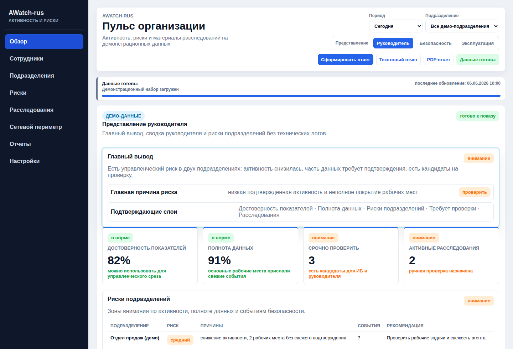
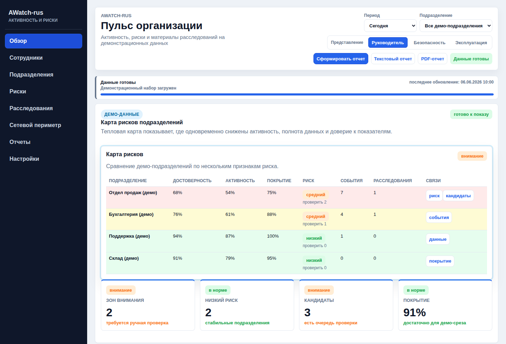
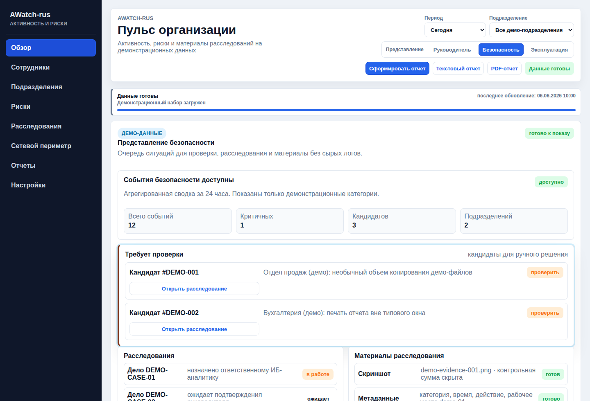
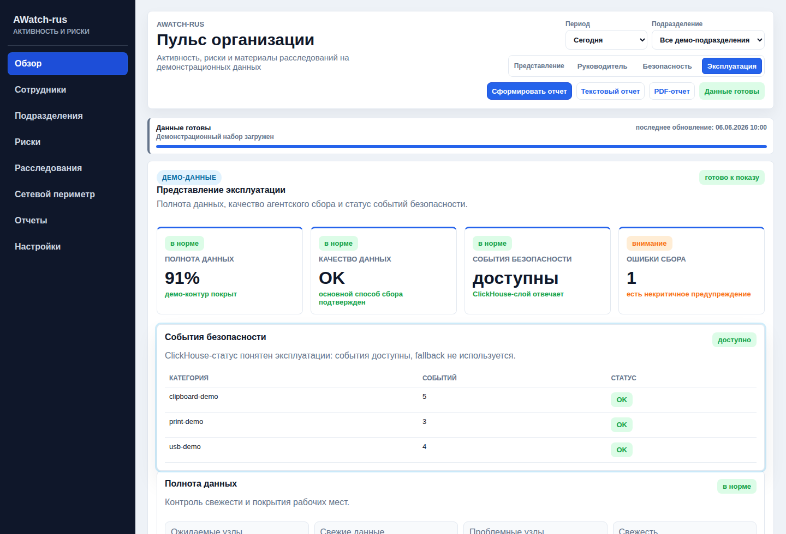
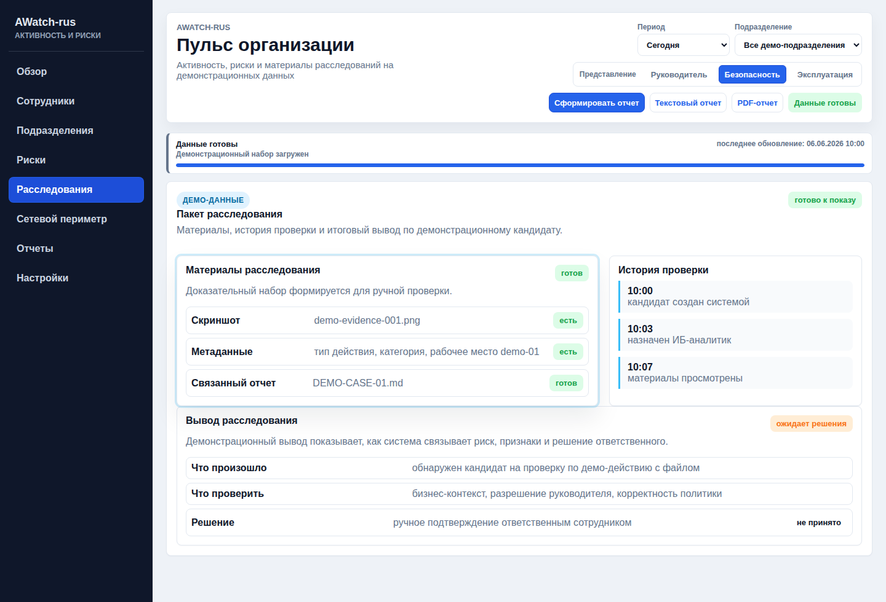
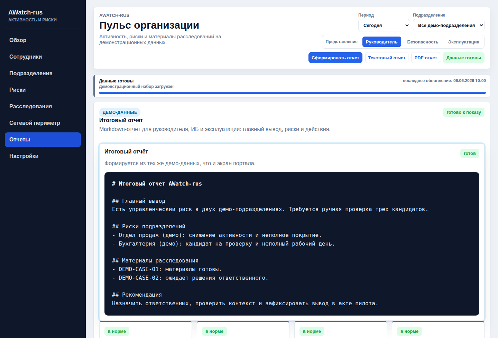

# AWatch-rus

AWatch-rus / DetMir - программный комплекс операционного контроля,
технического аудита, оценки трудоотдачи сотрудников и мониторинга
корпоративной ИТ-инфраструктуры на базе ActivityWatch, Rust-сервисов
автоматизации, Grafana/Prometheus-витрин и модулей расследования инцидентов.

Проект не позиционируется как сертифицированная DLP/SIEM/EDR/XDR/СЗИ. DLP,
evidence и Hayabusa используются как прикладные модули внутри платформы
операционного контроля и технического аудита.

## Назначение

- DetMir Workforce: активность сотрудников, загрузка, RDP/1C/рабочие
  приложения и управленческие отчеты для владельца бизнеса.
- DetMir Security: DLP-сигналы, evidence, очередь кейсов и audit действий
  оператора без заявления продукта как сертифицированной СЗИ.
- DetMir Forensics: цепочки событий, Hayabusa/offline-разбор и материалы для
  внутреннего расследования.
- Контроль доступности и свежести данных ActivityWatch.
- Учет активного времени, RDP-сессий, окон, приложений и рабочих интервалов.
- Витрины Grafana для администратора, оператора ИБ и руководителя.
- Автоматизация runbook-проверок, health-check, SLO и безопасного auto-heal.
- Сбор evidence по инцидентам и аудит действий оператора.

## Rust-first runtime

Основной серверный runtime DetMir переведен на Rust: status/check/auto-heal,
SLO, worktime, DLP server-side helpers, evidence и install-kit tooling.

Python в репозитории остается для вспомогательных направлений: Telegram bot
runtime, OCR/content-analysis, 1C/AI/ETL integration и MCP/dev helpers. Эти
части не являются ядром Rust-first runtime.

Портальный слой зафиксирован как Rust server-rendered HTML + HTMX-compatible
JSON API, OpenAPI и TypeScript declarations. Dioxus не используется и не
рассматривается для Pilot v1.0. React, Tauri и Electron также не входят в
текущий основной UI.

## Что видит оператор

- Работал ли пользователь за компьютером или в удаленной сессии.
- Когда была активность, простой и переключение окон.
- Какие приложения, сайты и процессы чаще всего были в работе.
- Есть ли события, важные для ИБ: копирование, печать, USB, подозрительные сайты.
- Не пропали ли данные с рабочих компьютеров и RDP-сессий.

## Кому это полезно

- Владельцу и руководителю - видеть активность, загрузку команды,
  простои, перегрузки и рабочие приложения без просмотра логов.
- ИБ - заметить DLP-сигналы и подозрительную активность.
- Администратору - проверить, что сборщики и сервер работают стабильно.

## Интерфейс

Скриншоты ниже подготовлены на демонстрационных данных: без реальных IP-адресов,
hostname, логинов, сотрудников, подразделений заказчика и событий безопасности.

### Главный вывод

Руководитель видит главный риск первым, затем сводку по достоверности
показателей, полноте данных, кандидатам на проверку и рискам подразделений.

### Карта рисков подразделений

Карта рисков показывает, где одновременно проседают активность, покрытие
агентов, доверие к показателям и количество ситуаций для проверки.

### Представление безопасности

ИБ получает очередь кандидатов на проверку, связанные расследования и материалы
без просмотра сырых логов и без автоматического принятия решений.

### Представление эксплуатации

Эксплуатация видит полноту данных, качество агентского сбора, ошибки сбора и
понятный статус событий безопасности через ClickHouse.

### Пакет расследования

Пакет расследования связывает материалы, историю проверки и итоговый вывод,
который ответственный сотрудник может подтвердить вручную.

### Итоговый отчет

Markdown-отчет собирает главный вывод, риски подразделений, материалы
расследований и рекомендации в формате, удобном для передачи руководителю.

## Если дашборд пустой

Обычно это значит одно из трех: выбран слишком узкий период времени, рабочий компьютер давно не присылал события или временно не обновилась витрина в Grafana. Начните с периода `Last 24 hours`, затем переходите к техническим разделам ниже.

## Поставка и регистрация

- [Позиционирование для реестра российского ПО](docs/DETMIR_RUSSIAN_SOFTWARE_REGISTRY_POSITIONING_RU.md)
- [Сведения для подачи в реестр](REGISTER_RU_SOFTWARE.md)
- [Описание продукта](PRODUCT_DESCRIPTION_RU.md)
- [Журнал изменений](CHANGELOG_RU.md)
- [Установка для эксперта](INSTALL_FOR_EXPERT_RU.md)
- [Сценарий экспертной проверки](docs/EXPERT_TEST_SCENARIO_RU.md)
- [Release manifest 2026-06](docs/RELEASE_MANIFEST_2026-06.md)
- [Эксплуатационный профиль](docs/OPERATIONAL_PROOF_PROFILE_RU.md)
- [Коммерческие модули DetMir](docs/DETMIR_COMMERCIAL_MODULES_RU.md)
- [Архитектурный baseline](docs/ARCHITECTURE_BASELINE_RU.md)
- [Пакет пилота для заказчика](docs/CUSTOMER_PILOT_PACK_RU.md)
- [Pilot v1.0](docs/PILOT_V1_RU.md)
- [Ролевая модель портала](docs/ROLES_RU.md)
- [UEBA Score v1](docs/UEBA_SCORE_RU.md)
- [pfSense integration readiness](docs/PFSENSE_INTEGRATION_RU.md)
- [Сценарий демонстрации заказчику](docs/CUSTOMER_DEMO_SCENARIO_RU.md)
- [Аудит готовности к пилоту](docs/PILOT_READINESS_AUDIT_RU.md)
- [Позиционирование для первой встречи](docs/SALES_POSITIONING_RU.md)
- [Преддемо-сценарий](docs/DEMO_RUNBOOK_RU.md)
- [Сторонние компоненты](THIRD_PARTY_COMPONENTS.md)
- [Сторонние лицензии](THIRD_PARTY_LICENSES_RU.md)
- [Архитектура](docs/ARCHITECTURE_RU.md)
- [Установка](docs/INSTALL_RU.md)
- [Руководство администратора](docs/ADMIN_GUIDE_RU.md)
- [Руководство оператора](docs/OPERATOR_GUIDE_RU.md)
- [Лицензия](LICENSE)

## Техническая документация

Для эксплуатации и настройки:

- [Wiki home](docs/wiki/Home.md)
- [Getting Started and Prerequisites](docs/wiki/Getting-Started-and-Prerequisites.md)
- [Server Infrastructure](docs/wiki/Server-Infrastructure.md)
- [Operations, CI/CD, and Quality Assurance](docs/wiki/Operations-CI-CD-and-Quality-Assurance.md)
- [Full deployment manual](docs/FULL_DEPLOYMENT_MANUAL_RU.md)

Для мониторинга:

- [Grafana and Prometheus Monitoring Stack](docs/wiki/Grafana-and-Prometheus-Monitoring-Stack.md)
- [Grafana dashboards guide](docs/GRAFANA_DASHBOARDS_RU.md)
- [Prometheus Exporter](docs/wiki/Prometheus-Exporter.md)

Для сборщиков и интерфейса:

- [Windows Collector Suite](docs/wiki/Windows-Collector-Suite.md)
- [Worktime API and UI Bridge](docs/wiki/Worktime-API-and-UI-Bridge.md)
- [Russian WebUI Patch and Localization](docs/wiki/Russian-WebUI-Patch-and-Localization.md)
