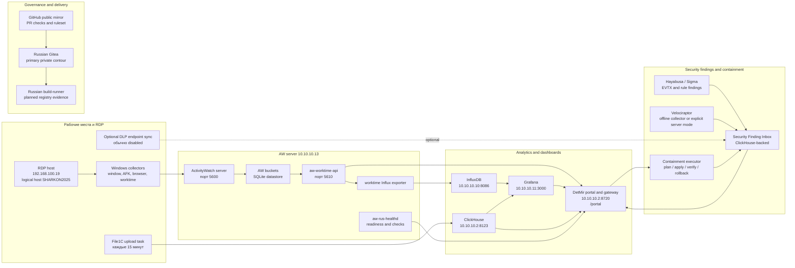
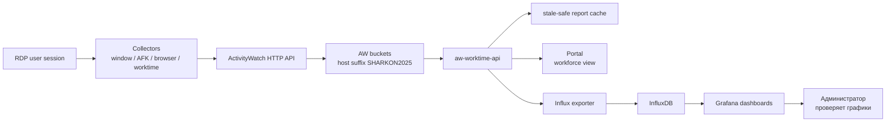
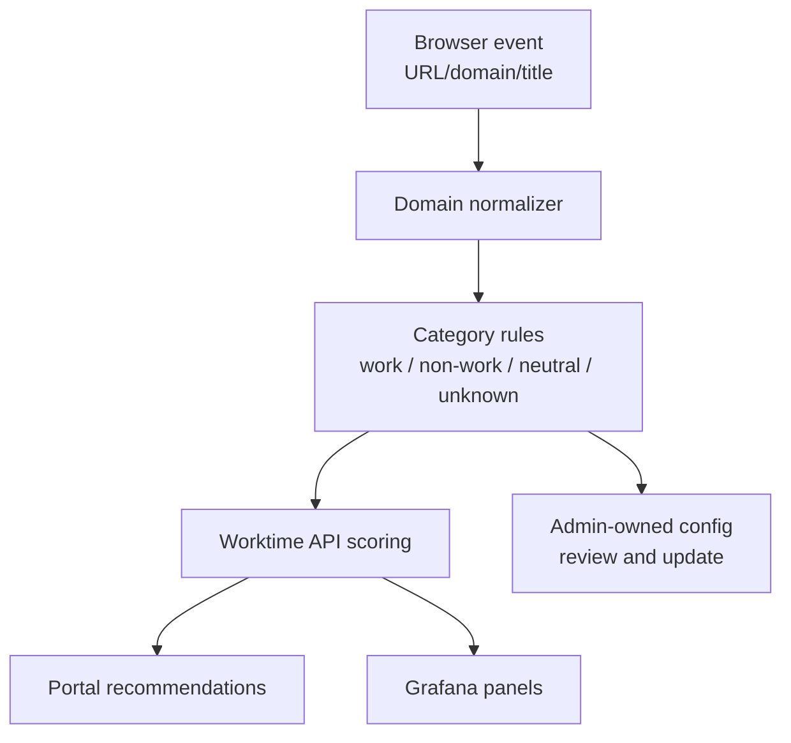
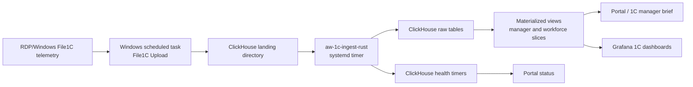
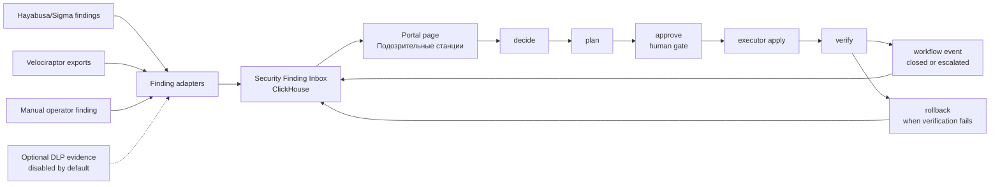
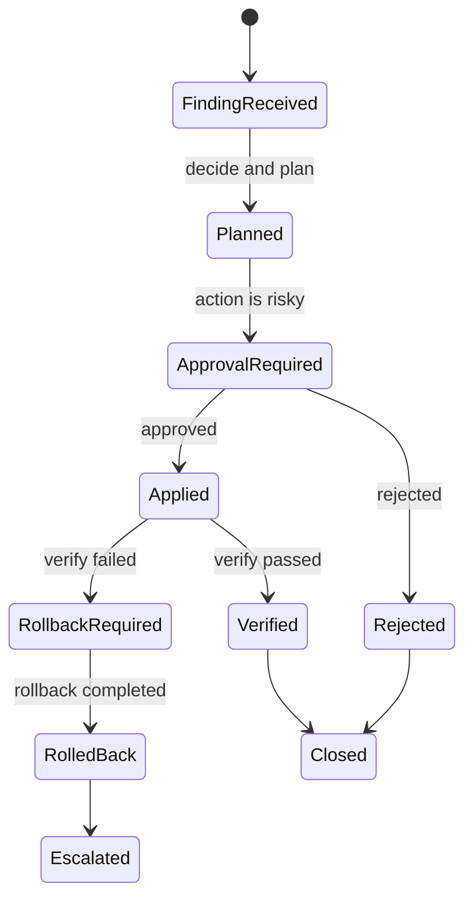
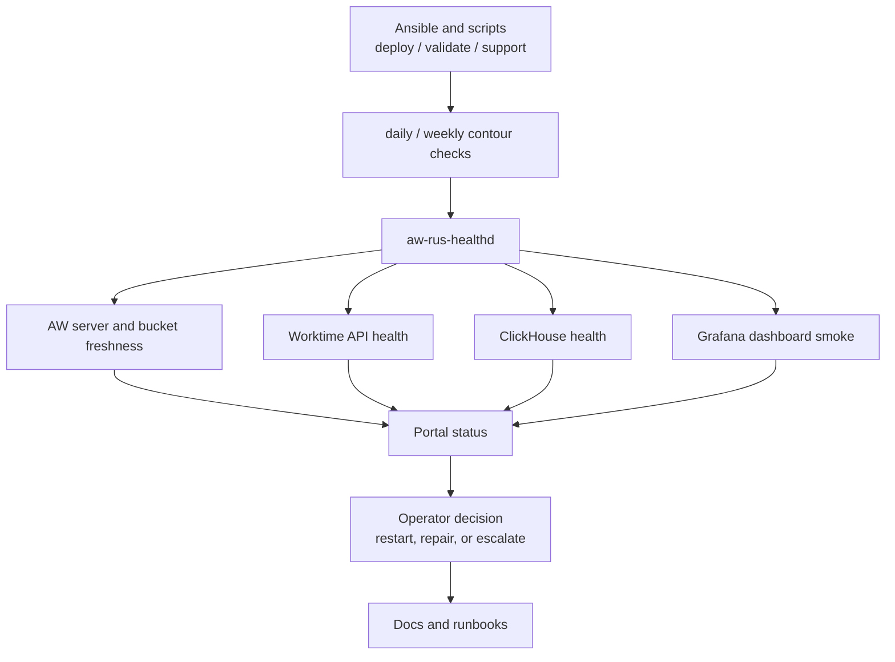
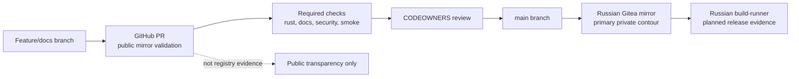

# AWatch-rus / DetMir: модульная схема комплекса

Статус: операторская архитектурная карта для просмотра прямо в GitHub/Gitea.

Документ описывает, как связаны основные модули AWatch-rus / DetMir, где
проходят данные и где администратор видит результат. Диаграммы выполнены в
Mermaid: GitHub и Gitea отображают их непосредственно на странице Markdown.

## 1. Границы и честные утверждения

- AWatch-rus / DetMir не заявляется как сертифицированная СЗИ, DLP, SIEM, EDR
  или XDR.
- GitHub Actions и GitHub issues используются как публичная инженерная
  видимость и mirror validation, а не как evidence российского release-контура.
- Основной российский контур поставки и контроля: private Gitea плюс
  планируемый российский build-runner.
- Текущий production-профиль DetMir держит тяжелый DLP runtime отключенным для
  снижения нагрузки на Proxmox, InfluxDB, Grafana, ClickHouse и AW server.
  DLP-модуль не удален и может быть подключен отдельно после решения оператора.
- Hayabusa/Sigma и Velociraptor используются как слой findings/forensics. Они не
  входят в горячий путь расчета рабочего времени и не должны запускать
  блокировку рабочих станций без явного approval.

## 2. Карта модулей верхнего уровня



## 3. Основные модули

| Модуль | Где работает | Что делает | Куда пишет/отдает |
|---|---|---|---|
| Windows collectors | RDP/Windows hosts | Собирают окна, AFK, браузерные домены, рабочие сессии | ActivityWatch API |
| ActivityWatch server | `10.10.10.13:5600` | Принимает события и хранит buckets | SQLite datastore, HTTP API |
| Worktime API | `10.10.10.13:5610` | Строит отчеты рабочего времени и management-срез | Portal, Influx exporter |
| Influx exporter | AW server | Перекладывает рабочие метрики во временные ряды | InfluxDB |
| InfluxDB | `10.10.10.10:8086` | Хранит time-series для Grafana | Grafana |
| Grafana | `10.10.10.11:3000` | Показывает dashboards по активности, дисциплине и состоянию | Администратор, portal links |
| DetMir portal | `10.10.10.2:8720/portal` | Единая витрина: статус, workforce, security inbox, ссылки | Browser UI/API |
| ClickHouse File1C | `10.10.10.2:8123` | Хранит 1C/file telemetry и security findings | Portal, Grafana, manager API |
| Security Finding Inbox | ClickHouse + Rust CLI/API | Нормализует подозрительные станции и workflow | Portal, executor, audit |
| Hayabusa/Sigma | AW server / security host | Разбирает Windows EVTX и Sigma-compatible findings | Inbox |
| Velociraptor | Optional mode | Собирает endpoint forensics/artifacts | Inbox/importers |
| DLP runtime | Optional mode | Тяжелый evidence/DLP слой, в production сейчас disabled | Inbox/AW/ClickHouse when enabled |
| Containment executor | Отдельный процесс | Выполняет только approved plan/apply/verify/rollback | Workflow events в ClickHouse |
| readiness/healthd | AW server and gateway | Проверяет живость сервисов, freshness, деградации | Portal/status/logs |

## 4. Горячий путь рабочего времени

Этот путь должен оставаться быстрым и независимым от тяжелых security-модулей.
DLP, Velociraptor и Hayabusa не должны тормозить расчет рабочих отчетов.



Ключевой принцип: физическое имя или IP RDP-сервера может измениться, но
логический host id для buckets и витрин остается стабильным, пока оператор
явно не проводит миграцию идентификаторов.

## 5. Отбор и категоризация ресурсов

Браузерные события идут в общий поток ActivityWatch, затем интерпретируются
политикой рабочих/нерабочих ресурсов. Категории должны храниться как
управляемая конфигурация, а не как зашитые в код одиночные домены.



Администратор должен видеть не только итоговые минуты, но и объяснение:
какой домен, какая категория, сколько времени, почему это считается рабочим
или нерабочим.

## 6. ClickHouse / File1C / управленческая аналитика



Этот контур нужен для управленческой аналитики и файловых/1C-срезов. Он не
заменяет ActivityWatch hot path и не должен блокировать портал при временной
деградации ClickHouse.

## 7. Security Finding Inbox и управляемое containment





Запрет: findings не должны автоматически блокировать рабочую станцию. Исполнение
возможно только после явного approval и через отдельный executor, который
пишет результат обратно в workflow-аудит.

## 8. Операционный контроль и recovery



Важное разделение: routine checks не должны автоматически включать тяжелый DLP
runtime и не должны менять сетевые маршруты. Любое изменение маршрутизации,
firewall или containment выполняется как отдельное управляемое действие.

## 9. Governance, GitHub и Gitea



GitHub полезен для публичной проверяемости: PR, issues, checks, branch ruleset.
Но для российского реестрового release evidence нужен отдельный российский
контур сборки и хранения артефактов.

## 10. Оркестрация и поддержание актуальности

Оркестрационные entrypoints отдельно зафиксированы в
[docs/ORCHESTRATION_MAP_RU.md](ORCHESTRATION_MAP_RU.md). Этот документ
связывает архитектурные модули с Ansible playbooks, systemd timers, Windows
Scheduled Tasks и read-only check scripts.

В репозитории есть guard:

```bash
bash scripts/check_orchestration_map.sh
```

Он не ходит в production и не меняет runtime. Его задача - проверить, что
карта оркестрации ссылается на реальные playbooks/scripts и содержит
обязательные safety-маркеры: DLP optional mode, Hayabusa/Velociraptor boundary,
approval gate для containment и разделение GitHub/Gitea release контуров.

## 11. Где смотреть руками

| Что проверить | Где смотреть |
|---|---|
| Единый портал DetMir | `/portal` на gateway |
| Рабочая активность и рекомендации | Portal workforce pages, Worktime API |
| Графики по сотрудникам и приложениям | Grafana dashboards `detmir-aw-main`, `detmir-rdp-user-activity` и связанные panels |
| Состояние AW buckets | ActivityWatch API и readiness/status в portal |
| 1C/File analytics | Portal 1C manager views, ClickHouse dashboards |
| Подозрительные станции | Portal security view / Security Finding Inbox |
| Hayabusa/Velociraptor findings | Inbox import status, security dashboards, runbooks |
| Runtime checks | `aw-rus-healthd`, contour check scripts, portal status |
| Код и evidence процесса | GitHub PR/issues, private Gitea mirror |

## 12. Связанные документы

- [docs/ARCHITECTURE_RU.md](ARCHITECTURE_RU.md)
- [docs/UNIFIED_OPERATING_MODEL_RU.md](UNIFIED_OPERATING_MODEL_RU.md)
- [docs/ORCHESTRATION_MAP_RU.md](ORCHESTRATION_MAP_RU.md)
- [docs/GRAFANA_DASHBOARDS_RU.md](GRAFANA_DASHBOARDS_RU.md)
- [docs/DLP_OPTIONAL_RUNTIME_RU.md](DLP_OPTIONAL_RUNTIME_RU.md)
- [docs/PRODUCTION_READINESS_RU.md](PRODUCTION_READINESS_RU.md)
