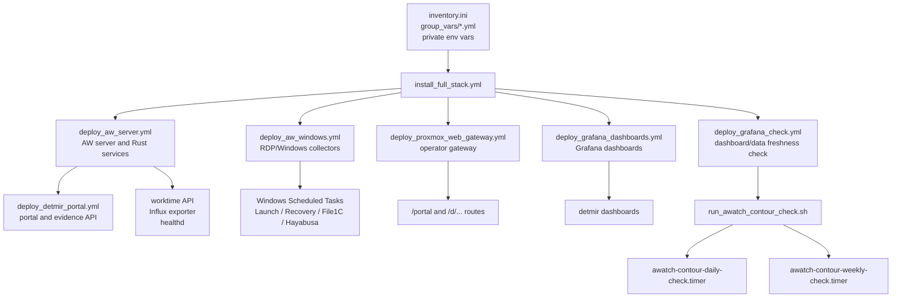
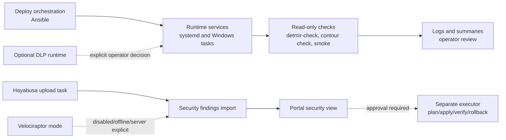
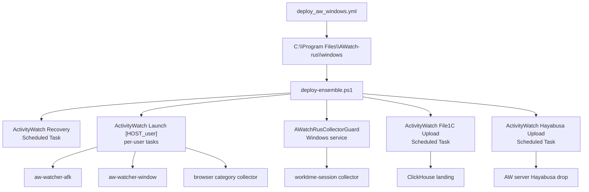

# AWatch-rus / DetMir: карта оркестрации

Статус: актуальная карта deploy/check orchestration для просмотра в
GitHub/Gitea.

Документ фиксирует, какие playbooks, systemd units и scripts управляют
модулями комплекса. Это не инструкция выполнять production deploy без окна
работ: большинство playbooks меняют сервисы, scheduled tasks или dashboards.

## 1. Общий порядок оркестрации

## 2. Оркестрационные entrypoints

| Зона | Entrypoint | Тип действия | Что поддерживает |
|---|---|---|---|
| Полный контур | `ansible/install_full_stack.yml` | deploy orchestrator | Последовательный запуск основных playbooks по группам inventory |
| AW server | `ansible/deploy_aw_server.yml` | deploy | ActivityWatch server, Rust binaries, server-side units |
| Windows/RDP | `ansible/deploy_aw_windows.yml` | deploy | Collectors, guard service, recovery task, File1C/Hayabusa scheduled tasks |
| Post-validate Windows | `ansible/post_validate_aw_windows.yml` | validation | Read-only-ish validation after Windows rollout |
| DetMir portal | `ansible/deploy_detmir_portal.yml` | deploy | Portal, evidence API, portal env, systemd services |
| Gateway | `ansible/deploy_proxmox_web_gateway.yml` | deploy | Nginx gateway, `/portal`, Grafana routes, operator index |
| Grafana dashboards | `ansible/deploy_grafana_dashboards.yml` | deploy | Version-controlled dashboards import |
| Grafana checker | `ansible/deploy_grafana_check.yml` | deploy/check | Dashboard and datasource health checks |
| File1C analytics | `ansible/deploy_file_1c_analytics.yml` | deploy | ClickHouse/File1C analytics server side |
| File1C Windows upload | `ansible/deploy_file_1c_windows_telemetry.yml` | deploy | Windows scheduled upload task |
| Optional DLP evidence | `ansible/deploy_dlp_evidence_sync.yml` | opt-in deploy | Evidence sync task only when DLP is explicitly enabled |
| pfSense poller | `ansible/deploy_aw_pfsense_poller.yml` | optional deploy | Network telemetry helper, outside workforce hot path |
| Daily/weekly checks | `scripts/run_awatch_contour_check.sh` | read-only check | Contour health bundle and optional smoke checks |
| Daily check timer | `ops/systemd/awatch-contour-daily-check.timer` | systemd timer | Scheduled daily run of contour check |
| Weekly check timer | `ops/systemd/awatch-contour-weekly-check.timer` | systemd timer | Scheduled weekly run of contour check |
| Support bundle | `scripts/detmir-support-daily.sh` and related scripts | read-only/support | Operator diagnostics and support artifacts |
| Orchestration guard | `scripts/check_orchestration_map.sh` | repository check | Ensures this map references live playbooks/scripts |

## 3. Runtime boundaries

Правила:

- routine deploy/recovery не должен сам включать тяжелый DLP runtime;
- Hayabusa/Velociraptor findings не являются заменой SIEM/DLP/EDR;
- блокировка рабочих станций возможна только через отдельный executor и явное
  approval;
- GitHub CI остается public mirror validation, а не registry release evidence;
- Gitea и российский build-runner остаются основным release/evidence контуром.

## 4. Windows/RDP task orchestration

Production DetMir использует стабильный logical host id `SHARKON2025` для
bucket-ов и витрин. Смена физического имени/IP RDP-сервера не должна
автоматически менять bucket suffix или Grafana variables.

## 5. Read-only checks and quality gates

| Проверка | Команда | Назначение |
|---|---|---|
| Orchestration map check | `bash scripts/check_orchestration_map.sh` | Проверяет, что карта оркестрации ссылается на реальные entrypoints |
| Repository quality gate | `bash scripts/quality-gate.sh` | Включает orchestration map check, shell/node/pwsh/ansible guards |
| Secret scan | `python3 scripts/public_secret_pattern_check.py` | Не допускает публичные секреты |
| Contour check | `bash scripts/run_awatch_contour_check.sh` | Read-only production contour check через env вне репозитория |
| Browser smoke | `scripts/aw-webui-browser-smoke.sh` | Проверяет operator/browser surface |
| Portal contract sync | `node scripts/check_portal_contract_sync.mjs` | Проверяет согласованность portal API/static contracts |

## 6. Что не делаем автоматически

- Не запускаем `deploy_dlp_full_stack.yml` как часть routine checks.
- Не включаем DLP timers/services без отдельного решения оператора.
- Не стартуем Velociraptor server/client contour автоматически на малом
  production Proxmox.
- Не меняем маршрутизацию, firewall или workstation containment из checks.
- Не публикуем credentials, tokens, passwords или customer identifiers в Git.

## 7. Связанные документы

- [MODULE_ARCHITECTURE_GRAPH_RU.md](MODULE_ARCHITECTURE_GRAPH_RU.md)
- [ARCHITECTURE_RU.md](ARCHITECTURE_RU.md)
- [UNIFIED_OPERATING_MODEL_RU.md](UNIFIED_OPERATING_MODEL_RU.md)
- [DLP_OPTIONAL_RUNTIME_RU.md](DLP_OPTIONAL_RUNTIME_RU.md)
- [PRODUCTION_READINESS_RU.md](PRODUCTION_READINESS_RU.md)
- [OPERATIONS_VALIDATION_RUNBOOK_RU.md](OPERATIONS_VALIDATION_RUNBOOK_RU.md)
- [GRAFANA_DASHBOARDS_RU.md](GRAFANA_DASHBOARDS_RU.md)
- [../ansible/README.md](../ansible/README.md)
