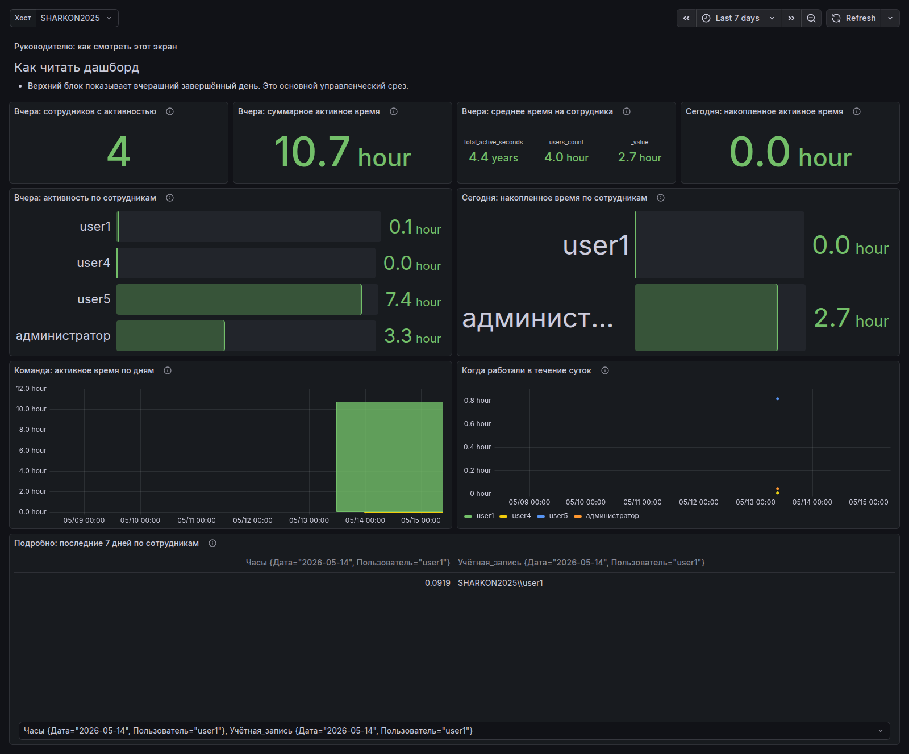
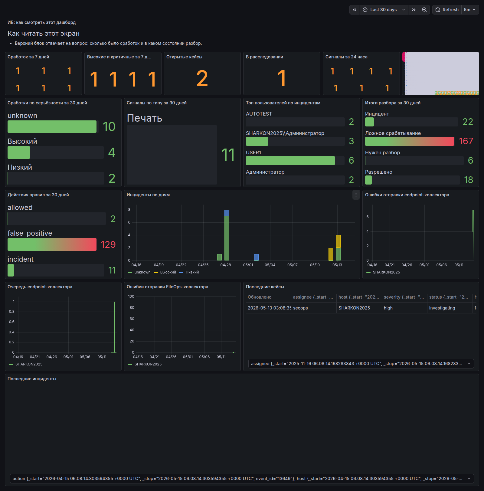
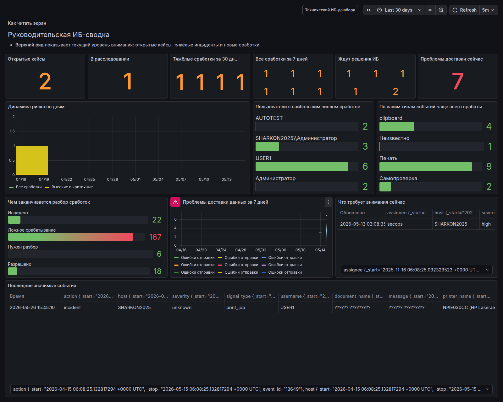
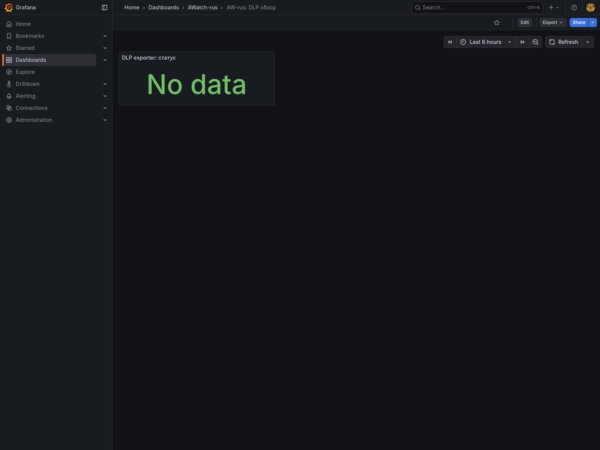
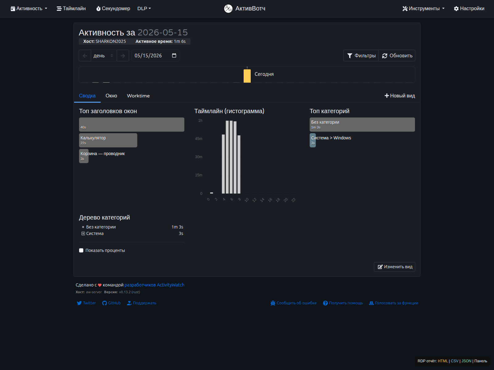
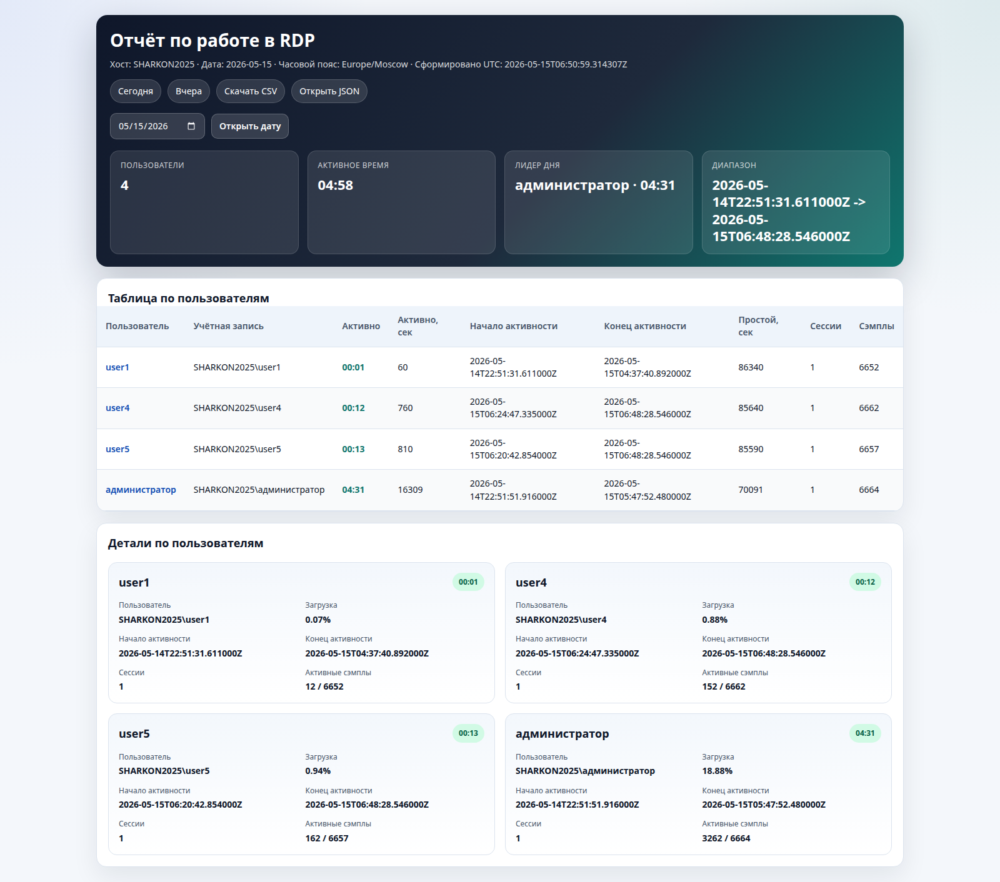
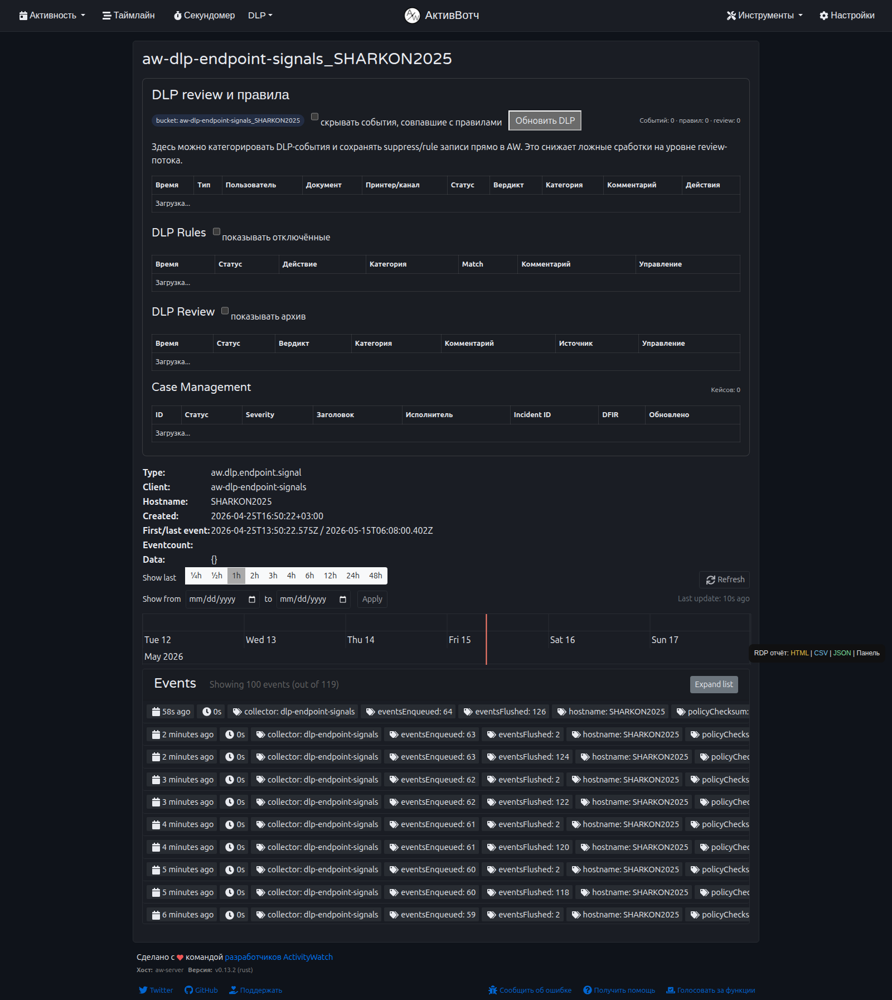

# AW-rus: презентационные экраны

Документ собирает живые экраны AW-rus и Grafana для demo, коммерческой презентации и внутренних согласований.

## 1. Работа пользователей в RDP

Управленческий экран по активности пользователей: кто работал, сколько времени, как выглядит команда по дням и кто активен сегодня.

Источник в репозитории:

- `grafana/detmir-rdp-user-activity-dashboard.json`

## 2. DLP и ИБ обзор

Технический dashboard для ИБ: сработки, severity, типы сигналов, verdict'ы, очередь кейсов и состояние доставки данных.

Источник в репозитории:

- `grafana/detmir-dlp-security-dashboard.json`

## 3. ИБ сводка для руководства

Экран для руководителя ИБ: открытые кейсы, инциденты повышенного риска, ожидающие решения события и верхнеуровневая динамика.

Источник в репозитории:

- `grafana/detmir-dlp-management-dashboard.json`

## 4. AW-rus: DLP обзор

Обзорный dashboard для быстрых стендовых demo и smoke-проверки самого DLP-контура.

Источник в репозитории:

- `grafana/dlp-dashboard.json`

## 5. AW-rus summary по активности

Экран ActivityWatch-Russian для просмотра реальной активности хоста и summary по выбранному дню.

## 6. Генерируемый отчёт по пользователям

Отдельный HTML-отчёт `RDP Worktime Report`, который система генерирует по пользователям: таблица, активное время, диапазон активности и детальные карточки по каждому сотруднику.

Источник в репозитории:

- `aw-server/aw-worktime-api.py`

Live endpoint:

- `http://10.10.10.13:5610/reports/worktime/today?format=html&date=2026-05-15`

## 7. AW-rus raw DLP bucket

Raw-представление bucket'а с endpoint-сигналами DLP. Показывает, что данные реально приходят в AW-rus до того, как уйти в InfluxDB/Grafana.

## Что показывать на встрече

1. `RDP` dashboard — ценность для руководства и HR.
2. `DLP и ИБ обзор` — глубина технического контроля для ИБ.
3. `ИБ сводка для руководства` — понятный риск-ориентированный слой.
4. `RDP Worktime Report` — отдельный генерируемый per-user отчёт, который можно показывать как доказательство реальной работы сотрудников.
5. `AW-rus summary` и `raw DLP bucket` — доказательство, что система не только рисует графики, а реально получает события на сервере.
