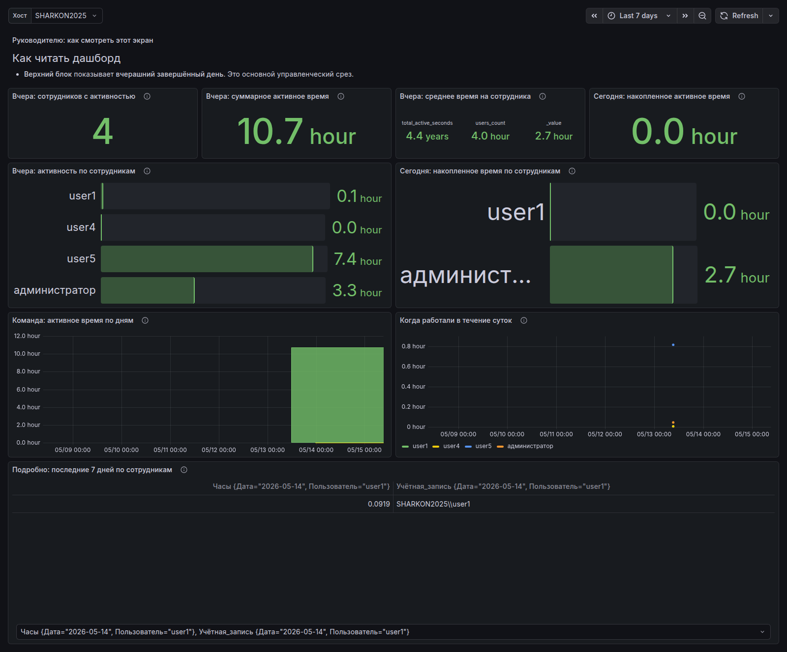
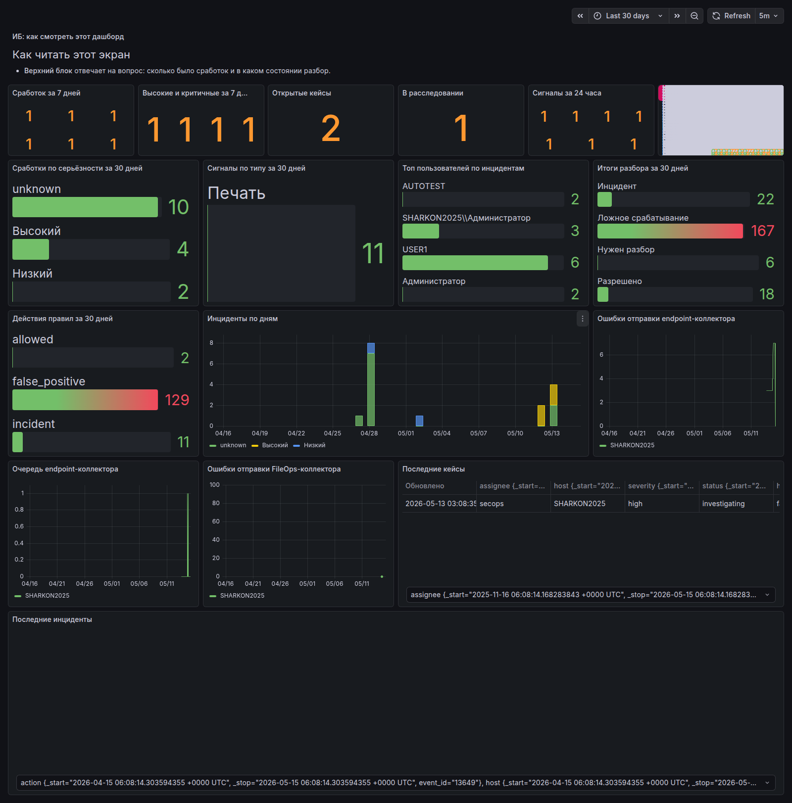
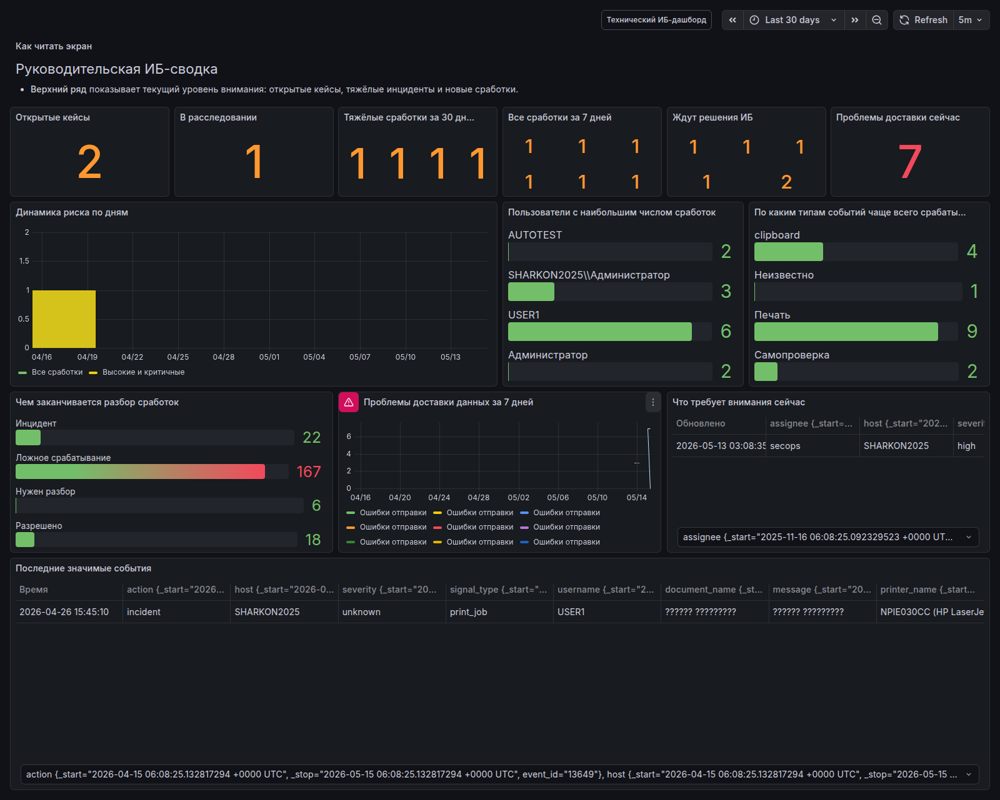
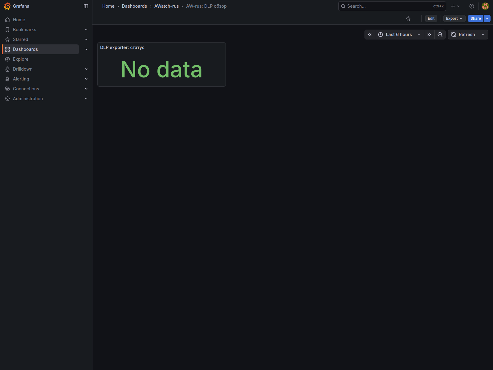
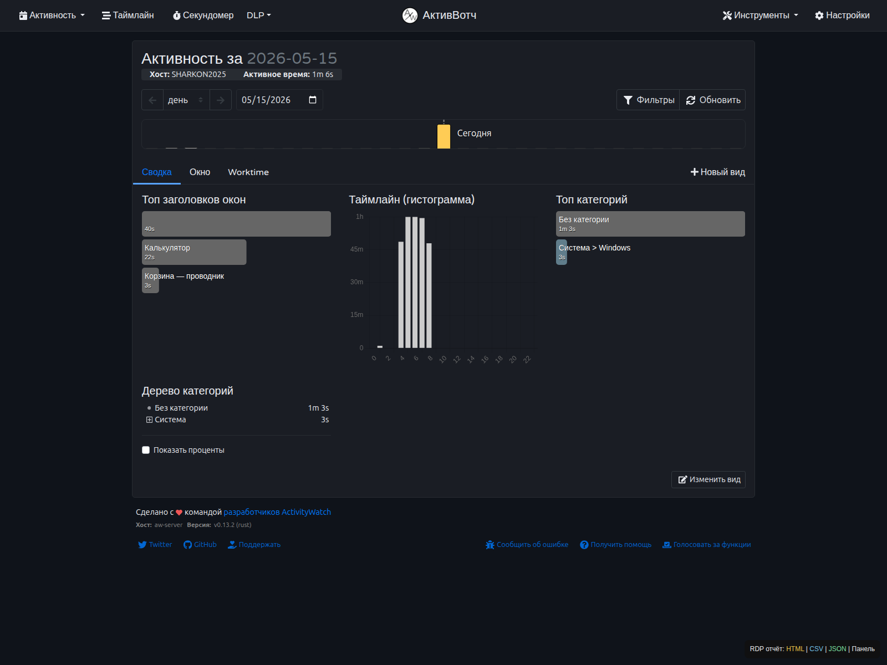
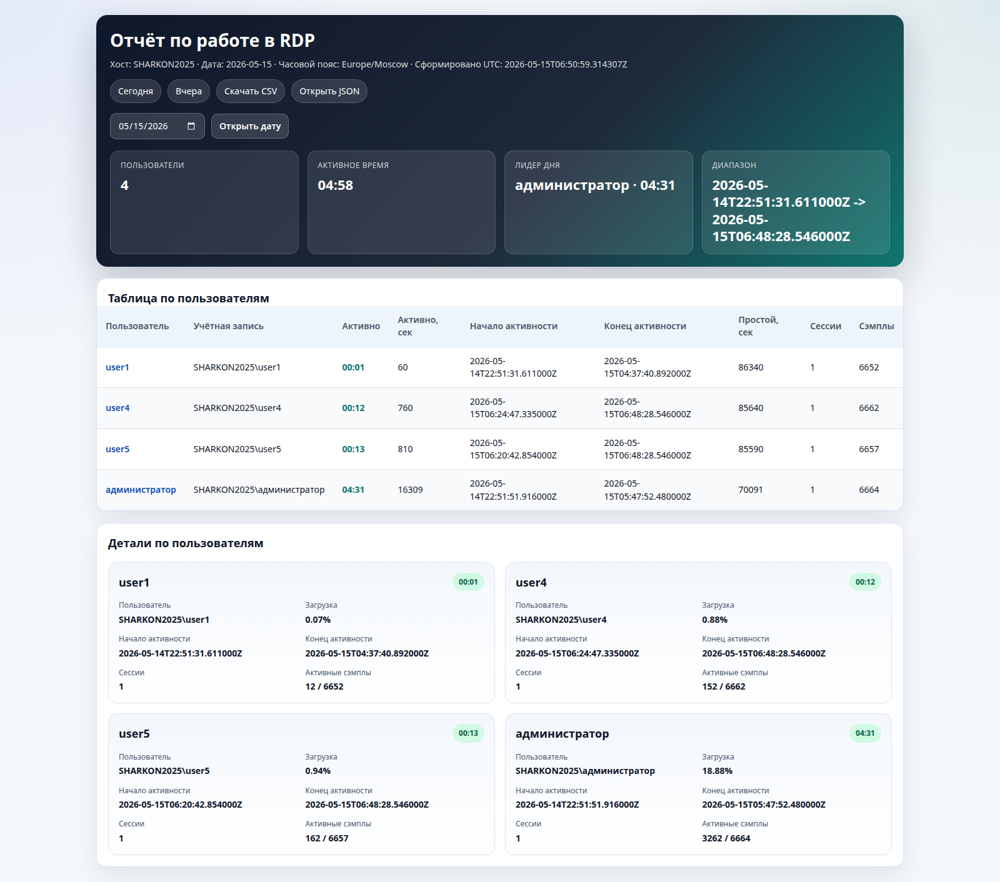
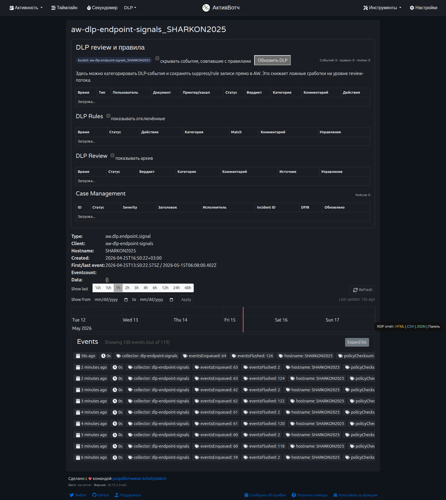

# DetMir / AW-rus: презентационные экраны

Документ собирает живые экраны DetMir / AW-rus и Grafana для demo,
коммерческой презентации и внутренних согласований.

## 1. DetMir Workforce: трудоотдача и загрузка

Первый коммерческий экран для владельца и руководителя. Показывает не
"сидел за компьютером", а активность: кто реально работал, кто
перегружен, кто простаивает, сколько времени уходит в RDP, 1C и рабочие
приложения.

Ключевые вопросы:

- кто реально работает;
- кто перегружен или простаивает;
- какие подразделения и процессы тормозят работу;
- сколько времени уходит на RDP/1C/рабочие приложения;
- где нужен управленческий разбор, а не технический лог.

## 2. Работа пользователей в RDP

Управленческий экран по активности пользователей: кто работал, сколько времени,
как выглядит команда по дням и кто активен сегодня.

Источник в репозитории:

- `grafana/detmir-rdp-user-activity-dashboard.json`

## 3. DLP и ИБ обзор

Технический dashboard для ИБ: сработки, severity, типы сигналов, verdict'ы, очередь кейсов и состояние доставки данных.

Источник в репозитории:

- `grafana/detmir-dlp-security-dashboard.json`

## 4. ИБ сводка для руководства

Экран для руководителя ИБ: открытые кейсы, инциденты повышенного риска, ожидающие решения события и верхнеуровневая динамика.

Источник в репозитории:

- `grafana/detmir-dlp-management-dashboard.json`

## 5. AW-rus: DLP обзор

Обзорный dashboard для быстрых стендовых demo и smoke-проверки самого DLP-контура.

Источник в репозитории:

- `grafana/dlp-dashboard.json`

## 6. AW-rus summary по активности

Экран ActivityWatch-Russian для просмотра реальной активности хоста и summary по выбранному дню.

## 7. Генерируемый отчёт по пользователям

Отдельный HTML-отчёт `RDP Worktime Report`, который система генерирует по пользователям: таблица, активное время, диапазон активности и детальные карточки по каждому сотруднику.

Источник в репозитории:

- `aw-server/aw-worktime-api.py`

Live endpoint:

- `http://aw-local-server:5610/reports/worktime/today?format=html&date=2026-05-15`

Дополнительно в management-only контуре есть отдельный управленческий отчёт:

- `http://aw-local-server:5610/reports/worktime/management?format=html&day=today`

Он показывает не только roster, но и:

- `Что делать сегодня`;
- покрытие рабочего окна против календарной активности;
- очередь действий руководителя;
- trend;
- свежесть источников данных.

## 8. AW-rus: DLP review, rules и события

Экран AW-rus по bucket `aw-dlp-endpoint-signals_*`: здесь видны живые DLP-события, review-вердикты, правила, case-management и нижняя лента событий. Это прямое доказательство, что данные реально приходят на сервер до агрегации в InfluxDB/Grafana.

## Рекомендуемый порядок демонстрации

1. `DetMir Workforce` - активность, загрузка, RDP/1C и рабочие
   приложения.
2. `RDP Worktime Report` - отдельный генерируемый per-user отчет как
   доказательство реальной работы сотрудников.
3. `DLP и ИБ обзор` - глубина технического контроля для ИБ.
4. `ИБ сводка для руководства` - понятный риск-ориентированный слой.
5. `AW-rus summary` и DLP review-экран - доказательство, что система не только
   рисует графики, а реально получает события на сервере.
