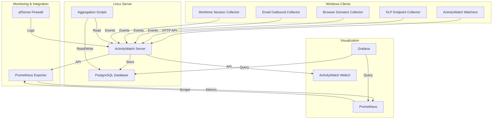

# ActivityWatch-Russian Architecture Diagram

## High-Level Architecture



## Component Interactions

### Data Flow

```
Windows Collectors → ActivityWatch Server → PostgreSQL Database
                                    ↓
                            Aggregation Scripts
                                    ↓
                            Grafana Dashboards
```

### DLP Monitoring Flow

```
User Activity (clipboard/print/USB) 
    ↓
DLP Endpoint Collector (PowerShell)
    ↓
DLP Policy Evaluation
    ↓
ActivityWatch Events (via HTTP API)
    ↓
PostgreSQL Database
    ↓
Aggregation Scripts (Python)
    ↓
Grafana DLP Dashboard
```

### Browser Monitoring Flow

```
User Browser Activity
    ↓
Browser Domains Collector (PowerShell)
    ↓
Domain Extraction & Categorization
    ↓
DLP Rule Check
    ↓
ActivityWatch Events
    ↓
WebUI Domain Dashboard
```

### Email Monitoring Flow

```
Outlook / SMTP Activity
    ↓
Email Outbound Collector (PowerShell)
    ↓
Email Policy Evaluation
    ↓
ActivityWatch Events
    ↓
Grafana Email Dashboard
```

### pfSense Integration Flow

```
pfSense Firewall Logs
    ↓
pfSense Poller (Python)
    ↓
HTTP API Query
    ↓
ActivityWatch Events
    ↓
Network Activity Dashboard
```

### Metrics Flow

```
ActivityWatch Server
    ↓
Prometheus Exporter (Python)
    ↓
HTTP Metrics Endpoint (port 9398)
    ↓
Prometheus Scraping
    ↓
Grafana Dashboards
```

## Component Details

### Windows Collectors

| Component | Language | Purpose | Output |
|-----------|----------|---------|--------|
| DLP Endpoint Collector | PowerShell | Monitor clipboard, print, USB | ActivityWatch events |
| Browser Domains Collector | PowerShell | Track visited domains | ActivityWatch events |
| Email Outbound Collector | PowerShell | Monitor sent emails | ActivityWatch events |
| Worktime Session Collector | PowerShell | Track work sessions | ActivityWatch events |

### Server Components

| Component | Language | Purpose | Dependencies |
|-----------|----------|---------|--------------|
| ActivityWatch Server | Rust | Core monitoring platform | SQLite/PostgreSQL |
| Aggregation Scripts | Python | Process DLP events | psycopg2, requests |
| Prometheus Exporter | Python | Export metrics to Prometheus | prometheus_client |

### Integration Points

| Integration | Protocol | Purpose |
|-------------|----------|---------|
| pfSense → AW | HTTP API | Firewall log collection |
| AW → Grafana | PostgreSQL | Direct database access |
| AW → Prometheus | HTTP /metrics | Metrics scraping |
| Collectors → AW | HTTP /api/buckets | Event submission |

## Deployment Architecture

```
Domain Controller
    ↓ (GPO / Scheduled Tasks)
Windows Workstations (user1, user2, ...)
    ↓ (PowerShell Collectors)
ActivityWatch Server (Linux)
    ↓
PostgreSQL Database
    ↓
Grafana + Prometheus Stack
```

## File System Structure

```
ActivityWatch-Russian/
├── windows/                          # Windows collectors
│   ├── dlp-endpoint-signals-collector.ps1
│   ├── browser-domains-native-collector.ps1
│   ├── email-outbound-collector.ps1
│   ├── worktime-session-collector.ps1
│   ├── deploy-domain-users.ps1      # Deployment script
│   └── ActivityWatch.Windows.Common.psm1
├── scripts/                          # Server scripts
│   ├── aggregate_dlp_events.py
│   └── merge_aw_server_dbs.py
├── aw-server/                        # WebUI patches
│   ├── aw-ru-patch.js
│   └── aw-sw-cleanup.js
├── pfsense/                          # pfSense integration
│   └── pfsense-aw-poller.py
├── grafana-1c/                       # Monitoring stack
│   ├── docker-compose.yml
│   ├── prometheus/
│   ├── grafana/
│   └── sql-exporter/
│       └── collectors/
│           └── aw_activitywatch.py
└── ansible/                          # Automation
    ├── playbooks/
    └── group_vars/
```

## Network Ports

| Service | Port | Protocol | Purpose |
|---------|------|----------|---------|
| ActivityWatch Server | 5600 | HTTP | WebUI & API |
| ActivityWatch Server | 5666 | HTTP | WebSocket |
| Prometheus | 9090 | HTTP | Metrics UI |
| Prometheus Exporter | 9398 | HTTP | AW metrics endpoint |
| Grafana | 3000 | HTTP | Dashboards |
| PostgreSQL | 5432 | TCP | Database |

## Data Models

### ActivityWatch Event Structure

```json
{
  "timestamp": "2024-01-01T12:00:00Z",
  "duration": 60.0,
  "data": {
    "title": "Window Title",
    "url": "https://example.com",
    "app": "chrome.exe",
    "type": "activity"
  }
}
```

### DLP Incident Structure

```json
{
  "timestamp": "2024-01-01T12:00:00Z",
  "type": "clipboard",
  "rule": "credit_card_pattern",
  "severity": "high",
  "user": "user1",
  "host": "WORKSTATION01",
  "screenshot": "path/to/screenshot.png"
}
```

## Key Dependencies

### Windows Dependencies
- PowerShell 5.1+
- .NET Framework 4.8
- ActivityWatch Windows binaries

### Linux Dependencies
- Python 3.8+
- PostgreSQL 12+
- Docker & Docker Compose
- Rust (for AW server compilation)

### Python Dependencies
```txt
psycopg2-binary
requests
prometheus_client
```

## Security Considerations

### Data Flow Security
- Collectors → Server: HTTP (can be upgraded to HTTPS)
- Server → Database: Local connection or SSL
- pfSense → Server: HTTP over VPN
- Prometheus → Exporter: HTTP internal network

### Access Control
- Windows collectors run as user context
- Server runs as dedicated service user
- Database access restricted to specific users
- Grafana authenticated via LDAP/Local users

## Monitoring & Alerting

### Metrics Collected
- Events per bucket
- Active hosts count
- Collector heartbeat status
- DLP incident rate
- Database query performance

### Alerting Rules
- Collector offline > 30 minutes
- High DLP incident rate
- Database connection failures
- Disk space < 20%
