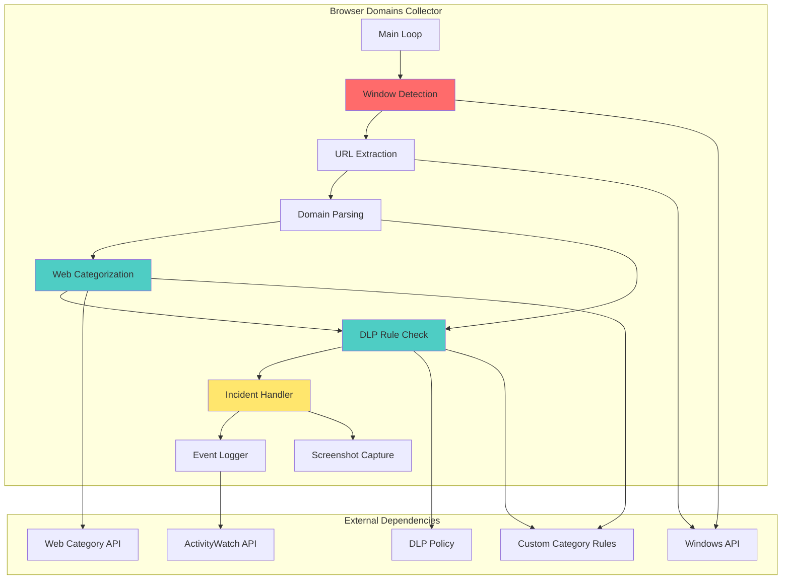
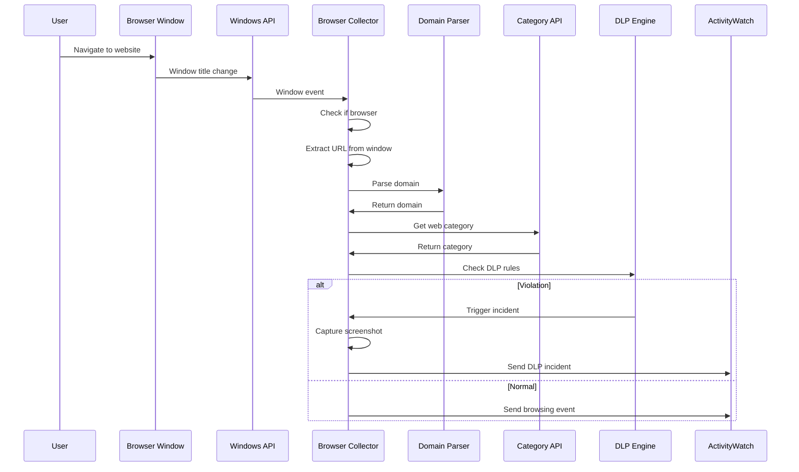
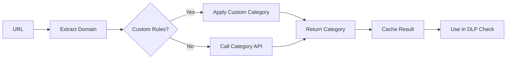
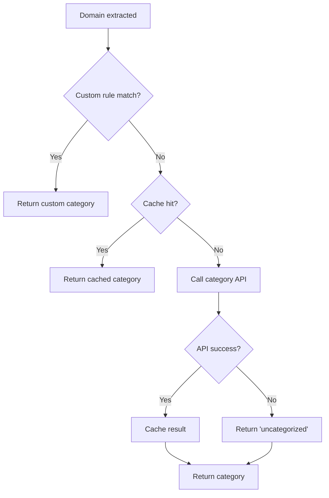

# Browser Domains Monitoring - Компонентная диаграмма

## Обзор
Мониторинг посещаемых доменов в браузерах с категоризацией и проверкой DLP правил.

## Архитектура



## Потоки данных

### Domain Detection Flow


### Domain Categorization Flow


## Ключевые функции

### Обнаружение и извлечение
- `browser_domains_native_collector_get_foregroundwindowcontext()` - контекст активного окна
- `browser_domains_native_collector_get_browserurlfromwindow()` - извлечение URL из окна
- `browser_domains_native_collector_get_hostfromurl()` - извлечение домена из URL
- `browser_domains_native_collector_get_rootdomain()` - получение корневого домена

### Категоризация
- `browser_domains_native_collector_get_webcategory()` - определение категории сайта
- `browser_domains_native_collector_load_customcategoryrules()` - загрузка кастомных правил
- `browser_domains_native_collector_test_domainlistmatch()` - проверка по спискам доменов

### DLP проверка
- `browser_domains_native_collector_get_dlpdecision()` - решение DLP
- `browser_domains_native_collector_test_dlprulematch()` - проверка DLP правила
- `browser_domains_native_collector_test_dlpruletimewindow()` - проверка временного окна
- `browser_domains_native_collector_should_emitincident()` - решение о создании инцидента

### Логирование
- `browser_domains_native_collector_write_collectorlog()` - лог коллектора
- `browser_domains_native_collector_write_dlpincidentlog()` - лог DLP инцидента
- `browser_domains_native_collector_send_heartbeat()` - heartbeat
- `browser_domains_native_collector_send_categoryheartbeat()` - heartbeat категорий

### Утилиты
- `browser_domains_native_collector_convertto_normalizedurl()` - нормализация URL
- `browser_domains_native_collector_test_domainmatch()` - проверка совпадения домена

## Конфигурация

### Custom Category Rules
```json
{
  "custom_categories": {
    "social_media": [
      "*.facebook.com",
      "*.twitter.com",
      "*.instagram.com"
    ],
    "news": [
      "*.news.com",
      "*.media.com"
    ],
    "blocked": [
      "*.malware.com",
      "*.phishing.com"
    ]
  }
}
```

### DLP Domain Rules
```json
{
  "domain_rules": [
    {
      "pattern": "*gambling*",
      "category": "gambling",
      "action": "alert",
      "severity": "medium"
    },
    {
      "pattern": "*adult*",
      "category": "adult",
      "action": "block",
      "severity": "high"
    }
  ]
}
```

### Deployment Config
```json
{
  "aw_server_url": "http://aw-server:5600",
  "bucket_prefix": "aw-watcher-browser-domains",
  "category_api_enabled": true,
  "custom_categories_enabled": true,
  "screenshot_on_incident": true,
  "heartbeat_interval": 60
}
```

## События

### Browsing Event
```json
{
  "timestamp": "2024-01-01T12:00:00Z",
  "type": "browsing",
  "data": {
    "url": "https://www.example.com/page",
    "domain": "example.com",
    "root_domain": "example.com",
    "category": "technology",
    "browser": "chrome.exe",
    "title": "Example Page Title",
    "user": "user1",
    "host": "WORKSTATION01"
  }
}
```

### DLP Incident Event
```json
{
  "timestamp": "2024-01-01T12:00:00Z",
  "type": "dlp_incident",
  "source": "browser_domain",
  "rule_id": "blocked_domains",
  "severity": "high",
  "data": {
    "url": "https://blocked.com",
    "domain": "blocked.com",
    "category": "malicious",
    "user": "user1",
    "host": "WORKSTATION01",
    "screenshot": "path/to/screenshot.png"
  }
}
```

### Category Heartbeat
```json
{
  "timestamp": "2024-01-01T12:00:00Z",
  "type": "category_heartbeat",
  "data": {
    "domains_seen": 150,
    "categories": {
      "technology": 50,
      "news": 30,
      "social_media": 40,
      "other": 30
    }
  }
}
```

## Поддерживаемые браузеры

- Google Chrome
- Mozilla Firefox
- Microsoft Edge
- Opera
- Яндекс.Браузер

## Зависимости

### Windows API
- Window enumeration
- Window title extraction
- Process information

### Внешние сервисы
- Web categorization API (опционально)
- ActivityWatch HTTP API

## Алгоритм категоризации



## Мониторинг

### Метрики
- Количество уникальных доменов
- Распределение по категориям
- Частота DLP инцидентов
- Кэш hit rate для категорий

### Алерты
- Коллектор не активен > 5 минут
- Высокий процент blocked категорий
- Ошибки category API
- Много неизвестных категорий

## Производительность

### Оптимизации
- Кэширование категорий доменов
- Batch запросы к category API
- Debouncing быстрых переходов
- Асинхронная отправка событий

### Настройки производительности
```json
{
  "cache_ttl": 86400,
  "batch_size": 50,
  "debounce_ms": 1000,
  "max_events_per_minute": 100
}
```
