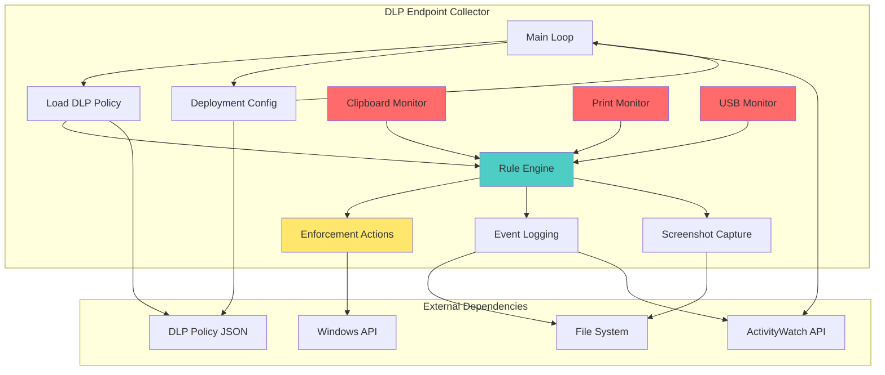
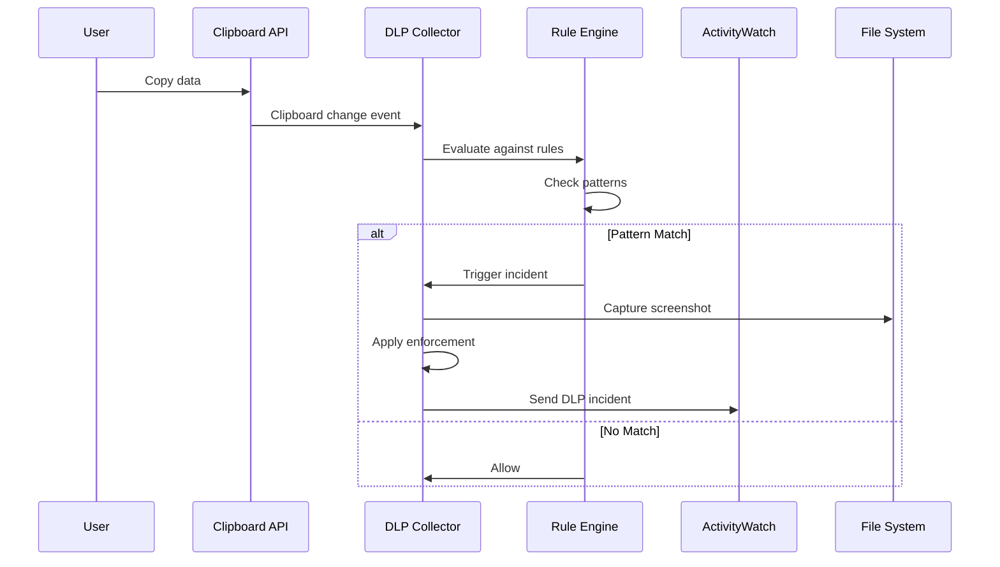
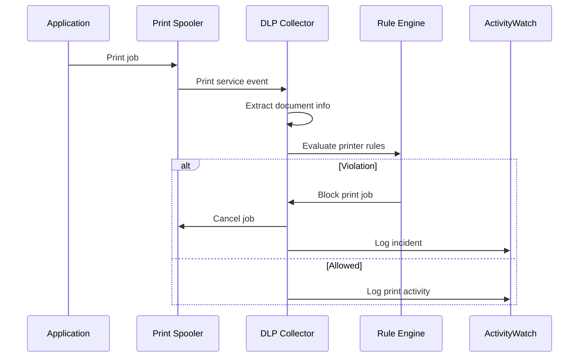
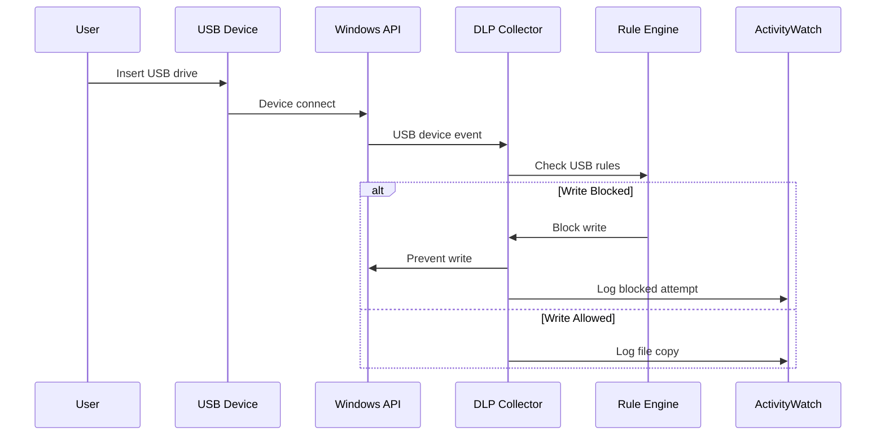

# DLP Endpoint Monitoring - Компонентная диаграмма

## Обзор
Мониторинг конечных точек для обнаружения утечек данных через clipboard, печать и USB.

## Архитектура



## Потоки данных

### Clipboard Monitoring Flow


### Print Monitoring Flow


### USB Monitoring Flow


## Ключевые функции

### Основные функции
- `dlp_endpoint_signals_collector_main()` - главный цикл коллектора
- `dlp_endpoint_signals_collector_load_dlppolicy()` - загрузка DLP правил
- `dlp_endpoint_signals_collector_get_deploymentconfig()` - чтение конфигурации

### Мониторинг
- `dlp_endpoint_signals_collector_evaluate_clipboardrules()` - проверка clipboard
- `dlp_endpoint_signals_collector_evaluate_printrules()` - проверка печати
- `dlp_endpoint_signals_collector_evaluate_usbrules()` - проверка USB

### Принудительные действия
- `dlp_endpoint_signals_collector_invoke_clipboardenforcement()` - блокировка clipboard
- `dlp_endpoint_signals_collector_invoke_printjobenforcement()` - блокировка печати
- `dlp_endpoint_signals_collector_invoke_usbwriteblockenforcement()` - блокировка USB

### Логирование
- `dlp_endpoint_signals_collector_write_endpointlog()` - запись логов коллектора
- `dlp_endpoint_signals_collector_send_dlpincidentheartbeat()` - heartbeat инцидентов
- `dlp_endpoint_signals_collector_capture_incidentscreenshot()` - захват скриншота

## Конфигурация

### DLP Policy Structure
```json
{
  "clipboard_rules": [
    {
      "pattern": "\\b\\d{4}-\\d{4}-\\d{4}-\\d{4}\\b",
      "description": "Credit card numbers",
      "severity": "high",
      "action": "block"
    }
  ],
  "print_rules": [
    {
      "printer_match": "*",
      "document_keywords": ["confidential", "secret"],
      "action": "block"
    }
  ],
  "usb_rules": [
    {
      "device_id": "*",
      "action": "block_write"
    }
  ]
}
```

### Deployment Config
```json
{
  "aw_server_url": "http://aw-server:5600",
  "bucket_prefix": "aw-watcher-dlp-endpoint",
  "heartbeat_interval": 60,
  "screenshot_on_incident": true,
  "enforcement_enabled": true
}
```

## События

### DLP Incident Event
```json
{
  "timestamp": "2024-01-01T12:00:00Z",
  "type": "dlp_incident",
  "source": "clipboard",
  "rule_id": "credit_card_pattern",
  "severity": "high",
  "data": {
    "matched_text": "****-****-****-1234",
    "user": "user1",
    "host": "WORKSTATION01",
    "application": "chrome.exe",
    "screenshot": "path/to/screenshot.png"
  }
}
```

### Heartbeat Event
```json
{
  "timestamp": "2024-01-01T12:00:00Z",
  "type": "heartbeat",
  "status": "running",
  "incidents_count": 5,
  "last_incident": "2024-01-01T11:55:00Z"
}
```

## Зависимости

### Windows API
- Clipboard API
- Print Spooler API
- USB Device Notification API
- Process API

### External Services
- ActivityWatch HTTP API
- File system (для скриншотов и логов)

## Развертывание

### Требования
- Windows 10/11
- PowerShell 5.1+
- ActivityWatch installed
- Административские права (для enforcement)

### Установка
```powershell
# Копирование коллектора
Copy-Item dlp-endpoint-signals-collector.ps1 C:\ProgramData\AWatch-rus\

# Настройка scheduled task
Register-ScheduledTask -TaskName "DLP Endpoint Collector" -Trigger $trigger -Action $action
```

## Мониторинг

### Метрики
- Количество инцидентов по типам (clipboard/print/USB)
- Частота срабатываний правил
- Успешность enforcement действий
- Heartbeat статус

### Алерты
- Коллектор не отправляет heartbeat > 5 минут
- Высокая частота DLP инцидентов
- Ошибки enforcement действий
