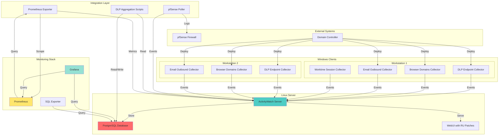

# ActivityWatch-Russian - Обзор компонентов и связей

## Полная архитектура системы



## Матрица связей компонентов

| Компонент | Тип | Подключается к | Протокол | Назначение |
|-----------|-----|----------------|-----------|------------|
| DLP Endpoint Collector | Windows Client | AW Server | HTTP API | Отправка DLP событий |
| Browser Domains Collector | Windows Client | AW Server | HTTP API | Отправка браузерных событий |
| Email Outbound Collector | Windows Client | AW Server | HTTP API | Отправка email событий |
| Worktime Session Collector | Windows Client | AW Server | HTTP API | Отправка сессий |
| ActivityWatch Server | Server | PostgreSQL | TCP | Хранение данных |
| ActivityWatch Server | Server | WebUI | HTTP | Отдача интерфейса |
| pfSense Poller | Integration | pfSense | HTTP API | Сбор логов firewall |
| pfSense Poller | Integration | AW Server | HTTP API | Отправка событий |
| DLP Aggregation | Integration | PostgreSQL | TCP | Обработка событий |
| DLP Aggregation | Integration | AW Server | HTTP API | Чтение событий |
| Prometheus Exporter | Integration | AW Server | HTTP API | Сбор метрик |
| Prometheus Exporter | Integration | Prometheus | HTTP | Отдача метрик |
| Prometheus | Monitoring | Exporter | HTTP | Scraping метрик |
| Grafana | Monitoring | Prometheus | HTTP | Запросы метрик |
| Grafana | Monitoring | PostgreSQL | TCP | Прямые запросы |
| SQL Exporter | Monitoring | PostgreSQL | TCP | SQL запросы |

## Потоки данных по уровням

### Уровень 1: Сбор данных (Windows)
```
┌─────────────────────────────────────────────────────────────┐
│                     Windows Clients                          │
├─────────────────────────────────────────────────────────────┤
│                                                              │
│  Workstation 1          Workstation 2        Workstation N   │
│  ┌─────────────┐        ┌─────────────┐        ┌──────────┐ │
│  │ DLP Collector│       │ DLP Collector│       │ DLP Coll.│ │
│  │ Browser Coll.│       │ Browser Coll.│       │ Browser  │ │
│  │ Email Coll. │       │ Email Coll. │       │ Email    │ │
│  │ Worktime    │       │             │       │          │ │
│  └──────┬──────┘        └──────┬──────┘        └────┬─────┘ │
│         │                      │                   │        │
│         └──────────────────────┼───────────────────┘        │
│                                │                            │
└────────────────────────────────┼────────────────────────────┘
                                 │ HTTP API
                                 ▼
```

### Уровень 2: Хранение и обработка (Linux)
```
┌─────────────────────────────────────────────────────────────┐
│                  Linux Server Layer                         │
├─────────────────────────────────────────────────────────────┤
│                                                              │
│                    ┌───────────────┐                        │
│                    │ AW Server     │◄────── Events          │
│                    │ (Rust)        │                        │
│                    └───────┬───────┘                        │
│                            │ Store                          │
│                            ▼                                │
│                    ┌───────────────┐                        │
│                    │ PostgreSQL    │                        │
│                    └───────┬───────┘                        │
│                            │                                │
└────────────────────────────┼───────────────────────────────┘
                             │
                             ▼
```

### Уровень 3: Интеграции
```
┌─────────────────────────────────────────────────────────────┐
│                Integration Layer                             │
├─────────────────────────────────────────────────────────────┤
│                                                              │
│  ┌──────────────┐    ┌──────────────┐    ┌──────────────┐  │
│  │ pfSense      │    │ DLP Aggreg.  │    │ Prometheus   │  │
│  │ Poller       │    │ Scripts      │    │ Exporter     │  │
│  └──────┬───────┘    └──────┬───────┘    └──────┬───────┘  │
│         │                   │                   │          │
│         ▼                   ▼                   ▼          │
│  ┌──────────────┐    ┌──────────────┐    ┌──────────────┐  │
│  │ pfSense FW   │    │ PostgreSQL    │    │ AW Server     │  │
│  └──────────────┘    └──────────────┘    └──────────────┘  │
│                                                              │
└─────────────────────────────────────────────────────────────┘
```

### Уровень 4: Визуализация
```
┌─────────────────────────────────────────────────────────────┐
│              Monitoring & Visualization                     │
├─────────────────────────────────────────────────────────────┤
│                                                              │
│  ┌──────────────┐    ┌──────────────┐    ┌──────────────┐  │
│  │ Prometheus   │◄───┤ Exporter     │    │ Grafana       │  │
│  │              │    │              │    │              │  │
│  └──────┬───────┘    └──────────────┘    └──────┬───────┘  │
│         │                                      │          │
│         │ Query                                │ Query    │
│         ▼                                      ▼          │
│  ┌──────────────┐                      ┌──────────────┐   │
│  │ Grafana      │                      │ PostgreSQL    │   │
│  │ Dashboards   │                      │              │   │
│  └──────────────┘                      └──────────────┘   │
│                                                              │
└─────────────────────────────────────────────────────────────┘
```

## Сценарии использования

### Сценарий 1: DLP инцидент
```
User copies sensitive data
    ↓
DLP Endpoint Collector detects
    ↓
Evaluates against rules
    ↓
Creates incident event
    ↓
Sends to AW Server
    ↓
Stored in PostgreSQL
    ↓
Aggregated by scripts
    ↓
Visible in Grafana DLP Dashboard
```

### Сценарий 2: Мониторинг браузера
```
User visits website
    ↓
Browser Domains Collector detects
    ↓
Extracts domain
    ↓
Categorizes website
    ↓
Checks DLP rules
    ↓
Sends event to AW Server
    ↓
Visible in WebUI Dashboard
```

### Сценарий 3: Метрики
```
Prometheus scrapes Exporter
    ↓
Exporter queries AW API
    ↓
Collects metrics
    ↓
Returns in Prometheus format
    ↓
Prometheus stores metrics
    ↓
Grafana visualizes in dashboards
```

## Зависимости развертывания

### Минимальная конфигурация
```
1 Linux Server:
  - ActivityWatch Server
  - PostgreSQL
  - WebUI with patches

1+ Windows Workstations:
  - DLP Endpoint Collector
  - Browser Domains Collector
  - Email Outbound Collector
```

### Полная конфигурация
```
1 Linux Server:
  - ActivityWatch Server
  - PostgreSQL
  - WebUI with patches
  - DLP Aggregation Scripts
  - Prometheus Exporter

1+ Windows Workstations:
  - DLP Endpoint Collector
  - Browser Domains Collector
  - Email Outbound Collector
  - Worktime Session Collector

1 pfSense Firewall:
  - pfSense Poller

1 Monitoring Server:
  - Prometheus
  - Grafana
  - SQL Exporter
```

## Порты и протоколы

| Компонент | Порт | Протокол | Направление |
|-----------|------|----------|-------------|
| ActivityWatch API | 5600 | HTTP | Inbound |
| ActivityWatch WebSocket | 5666 | WebSocket | Inbound |
| PostgreSQL | 5432 | TCP | Inbound |
| Prometheus | 9090 | HTTP | Inbound |
| Grafana | 3000 | HTTP | Inbound |
| Prometheus Exporter | 9398 | HTTP | Inbound |
| pfSense API | 443 | HTTPS | Outbound |

## Резервное копирование

### PostgreSQL Backup
```bash
# Daily backup
pg_dump activitywatch > backup_$(date +%Y%m%d).sql

# Restore
psql activitywatch < backup_20240101.sql
```

### AW Server Backup
```bash
# Backup SQLite databases (if used)
cp /var/lib/activitywatch/*.db /backup/

# Backup configuration
cp /etc/activitywatch/config.toml /backup/
```

## Масштабирование

### Горизонтальное масштабирование
- Добавление Windows workstation не требует изменений сервера
- Каждый workstation автономно отправляет события
- Server обрабатывает события от множества клиентов

### Вертикальное масштабирование
- Увеличение ресурсов PostgreSQL для больших объемов данных
- Разделение AW Server и PostgreSQL на разные машины
- Добавление реплик PostgreSQL для высокой доступности

## Мониторинг системы

### Ключевые метрики
- Количество активных хостов
- Скорость поступления событий
- Размер базы данных
- Latency обработки событий
- Статус коллекторов

### Алерты
- Коллектор неактивен > 5 минут
- Высокий процент DLP инцидентов
- PostgreSQL connection pool exhausted
- Диск > 80% заполнен
- AW Server недоступен
