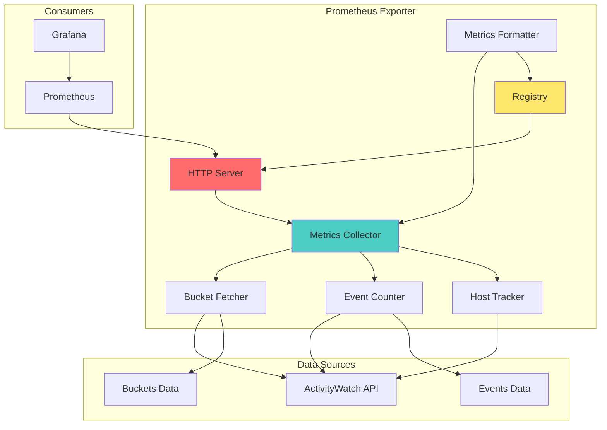
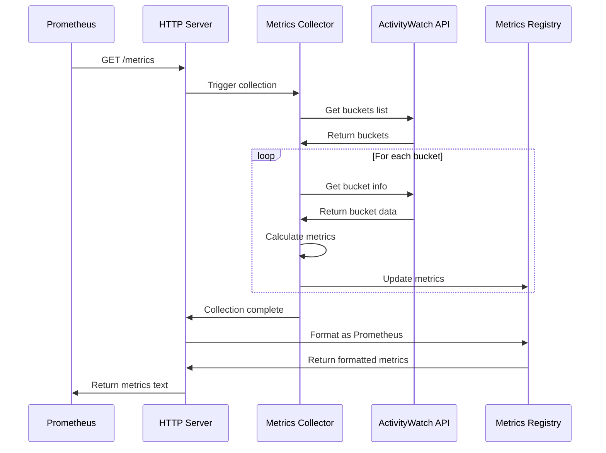
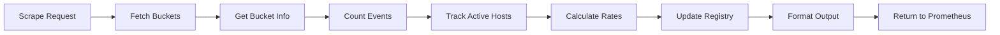

# Prometheus Metrics Exporter - Компонентная диаграмма

## Обзор
Экспорт метрик ActivityWatch в формате Prometheus для мониторинга и визуализации в Grafana.

## Архитектура



## Потоки данных

### Metrics Collection Flow


### Metrics Update Flow


## Ключевые функции

### Инициализация
- `aw_activitywatch_activitywatchexporter_init()` - инициализация exporter
- `aw_activitywatch_activitywatchexporter()` - главный класс exporter
- `aw_activitywatch_main()` - точка входа

### Сбор данных
- `aw_activitywatch_activitywatchexporter_get_buckets()` - получение списка buckets
- `aw_activitywatch_activitywatchexporter_get_bucket_info()` - информация о bucket
- `aw_activitywatch_activitywatchexporter_get_bucket_events()` - события bucket
- `aw_activitywatch_activitywatchexporter_collect_metrics()` - сбор всех метрик

### HTTP Server
- Запуск HTTP сервера на порту 9398
- Endpoint `/metrics` для Prometheus
- Endpoint `/health` для health checks

### Метрики
```python
# Bucket metrics
aw_bucket_events_total{bucket_id, host} - общее количество событий
aw_bucket_events_last_timestamp{bucket_id} - timestamp последнего события

# Host metrics
aw_host_active{host} - хост активен (1/0)
aw_host_last_seen{host} - время последней активности

# Collector metrics
aw_collector_heartbeat{host, collector_type} - heartbeat коллектора
aw_collector_status{host, collector_type, status} - статус коллектора

# Aggregation metrics
aw_aggregation_events_processed_total - обработано событий
aw_aggregation_last_success_timestamp - последний успешный запуск

# Exporter metrics
aw_exporter_scrape_duration_seconds - время обработки scrape
aw_exporter_up - exporter доступен (1/0)
```

## Конфигурация

### Config
```json
{
  "aw_base_url": "http://aw-server:5600",
  "listen_address": "0.0.0.0",
  "listen_port": 9398,
  "scrape_interval_seconds": 60,
  "bucket_prefixes": [
    "aw-watcher-dlp-endpoint",
    "aw-watcher-browser-domains",
    "aw-watcher-email-outbound",
    "aw-watcher-window"
  ],
  "cache_ttl_seconds": 30
}
```

### Environment Variables
```bash
AW_BASE_URL=http://aw-server:5600
EXPORTER_PORT=9398
SCRAPE_INTERVAL=60
LOG_LEVEL=INFO
```

## Пример метрик

### Prometheus Format
```
# HELP aw_bucket_events_total Total number of events in bucket
# TYPE aw_bucket_events_total gauge
aw_bucket_events_total{bucket_id="aw-watcher-dlp-endpoint-WORKSTATION01",host="WORKSTATION01"} 1523.0
aw_bucket_events_total{bucket_id="aw-watcher-browser-domains-WORKSTATION01",host="WORKSTATION01"} 3421.0

# HELP aw_host_active Host is active (1 or 0)
# TYPE aw_host_active gauge
aw_host_active{host="WORKSTATION01"} 1.0
aw_host_active{host="WORKSTATION02"} 0.0

# HELP aw_host_last_seen Unix timestamp of last activity
# TYPE aw_host_last_seen gauge
aw_host_last_seen{host="WORKSTATION01"} 1704110400.0
aw_host_last_seen{host="WORKSTATION02"} 1704100000.0

# HELP aw_exporter_scrape_duration_seconds Duration of scrape
# TYPE aw_exporter_scrape_duration_seconds gauge
aw_exporter_scrape_duration_seconds 0.523

# HELP aw_exporter_up Exporter is up (1 or 0)
# TYPE aw_exporter_up gauge
aw_exporter_up 1.0
```

## Prometheus Configuration

### scrape_config
```yaml
scrape_configs:
  - job_name: 'activitywatch'
    static_configs:
      - targets: ['localhost:9398']
    scrape_interval: 60s
    scrape_timeout: 30s
    metrics_path: /metrics
```

### Alerting Rules
```yaml
groups:
  - name: activitywatch_alerts
    rules:
      - alert: AWCollectorDown
        expr: aw_host_active == 0
        for: 5m
        labels:
          severity: warning
        annotations:
          summary: "ActivityWatch collector down on {{ $labels.host }}"
          
      - alert: AWExporterDown
        expr: aw_exporter_up == 0
        for: 2m
        labels:
          severity: critical
        annotations:
          summary: "ActivityWatch exporter is down"
          
      - alert: AWHighEventRate
        expr: rate(aw_bucket_events_total[5m]) > 100
        for: 5m
        labels:
          severity: warning
        annotations:
          summary: "High event rate on {{ $labels.host }}"
```

## Grafana Dashboard Queries

### Active Hosts
```promql
sum(aw_host_active) by (host)
```

### Events per Bucket
```promql
aw_bucket_events_total
```

### Event Rate
```promql
rate(aw_bucket_events_total[5m])
```

### Host Last Seen
```promql
aw_host_last_seen
```

### Collector Status
```promql
aw_collector_status{status="running"}
```

## Производительность

### Оптимизации
- Кэширование ответов AW API
- Batch запросы к buckets
- Connection pooling
- Асинхронная обработка

### Метрики производительности
```python
performance_metrics = {
    "scrape_duration_seconds": 0.5,
    "aw_api_latency_seconds": 0.2,
    "metrics_count": 50,
    "cache_hit_rate": 0.95
}
```

## Docker Deployment

### Dockerfile
```dockerfile
FROM python:3.11-slim

WORKDIR /app

COPY requirements.txt .
RUN pip install -r requirements.txt

COPY collectors/aw_activitywatch.py .

EXPOSE 9398

CMD ["python", "aw_activitywatch.py"]
```

### Docker Compose
```yaml
services:
  aw-exporter:
    build: ./sql-exporter
    ports:
      - "9398:9398"
    environment:
      - AW_BASE_URL=http://aw-server:5600
      - EXPORTER_PORT=9398
    depends_on:
      - aw-server
    restart: unless-stopped
```

## Health Check

### Endpoint: /health
```json
{
  "status": "healthy",
  "timestamp": "2024-01-01T12:00:00Z",
  "aw_server_reachable": true,
  "last_scrape_duration_seconds": 0.523,
  "metrics_count": 50
}
```

### Health Check Script
```bash
#!/bin/bash
response=$(curl -s http://localhost:9398/health)
status=$(echo $response | jq -r '.status')

if [ "$status" == "healthy" ]; then
    echo "Exporter is healthy"
    exit 0
else
    echo "Exporter is unhealthy"
    exit 1
fi
```

## Логирование

### Log Format
```json
{
  "timestamp": "2024-01-01T12:00:00Z",
  "level": "INFO",
  "message": "Metrics collection completed",
  "duration_seconds": 0.523,
  "buckets_processed": 10,
  "metrics_generated": 50
}
```

### Log Levels
- DEBUG - детальная информация о сборе
- INFO - нормальная работа
- WARNING - не критичные проблемы
- ERROR - ошибки при сборе метрик
- CRITICAL - exporter недоступен

## Безопасность

### Рекомендации
- Запускать за reverse proxy (nginx)
- Ограничить доступ по IP
- Использовать HTTPS в production
- Не экспортировать чувствительные данные

### Nginx Config
```nginx
location /metrics {
    allow 10.0.0.0/8;
    deny all;
    proxy_pass http://localhost:9398/metrics;
}
```
