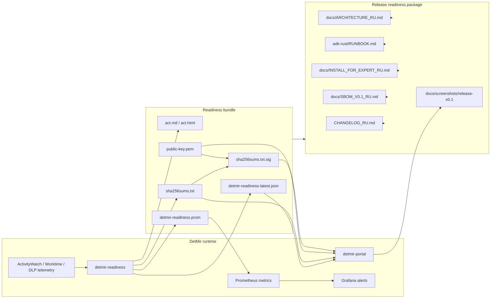

# Release-readiness v0.1 architecture

## Контрольные точки

1. `detmir-readiness` формирует bundle и Prometheus metrics.
2. Bundle имеет SHA-256 checksums и detached signature.
3. Portal показывает статус readiness и ручную проверку bundle.
4. Prometheus/Grafana поднимают alert при `detmir_readiness_ok == 0` или
   `detmir_readiness_signature_verified == 0`.
5. Release package содержит changelog, SBOM profile, install/runbook,
   architecture и обезличенные screenshots.
