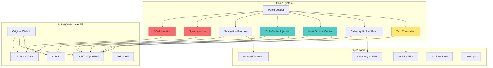
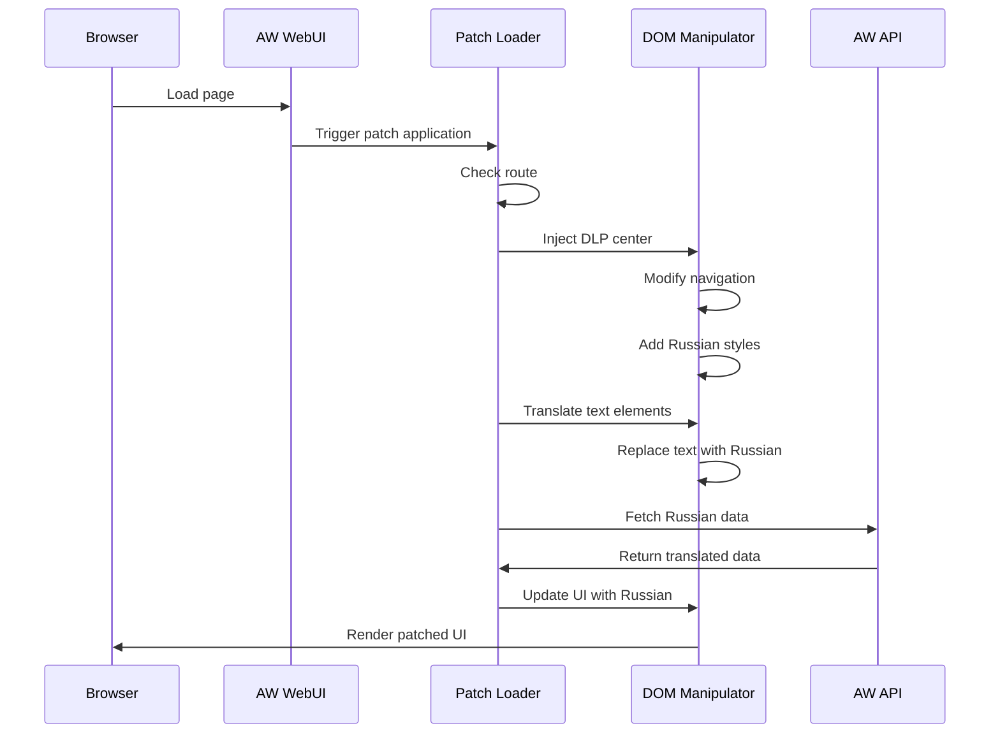
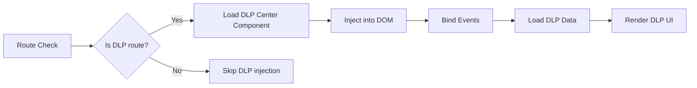

# WebUI Russian Localization Patches - Компонентная диаграмма

## Обзор
Система патчей для русификации и адаптации ActivityWatch WebUI под российские требования.

## Архитектура



## Потоки данных

### Patch Application Flow


### DLP Center Injection Flow


## Ключевые функции

### Загрузка патчей
- `aw_ru_patch_applypatch()` - применение патча
- `aw_ru_patch_scheduleapplypatch()` - отложенное применение
- `aw_ru_patch_ensurehostgroupsdata()` - обеспечение данных групп хостов

### Инъекция компонентов
- `aw_ru_patch_injectdlpnavigation()` - инъекция DLP навигации
- `aw_ru_patch_injectdlpreviewcenter()` - инъекция центра просмотра DLP
- `aw_ru_patch_injectdlpalertscenter()` - инъекция центра алертов
- `aw_ru_patch_injecthostgroupscenter()` - инъекция центра групп хостов
- `aw_ru_patch_injectpveauditcenter()` - инъекция центра аудита PVE

### Патчи навигации
- `aw_ru_patch_findprimarynavlist()` - поиск главного меню
- `aw_ru_patch_hidenoisenavigation()` - скрытие лишних пунктов
- `aw_ru_patch_removebaddlplinks()` - удаление битых DLP ссылок
- `aw_ru_patch_updatedlplinks()` - обновление DLP ссылок

### Патчи представлений
- `aw_ru_patch_enforcesafeactivityviewforpvehost()` - безопасный вид для PVE
- `aw_ru_patch_collapsereviewevents()` - сворачивание событий ревью
- `aw_ru_patch_collapseruleevents()` - сворачивание событий правил
- `aw_ru_patch_loadbucketevents()` - загрузка событий bucket

### Группы хостов
- `aw_ru_patch_getdefaulthostgroupsconfig()` - конфигурация групп по умолчанию
- `aw_ru_patch_matchhostgroup()` - сопоставление группы хоста
- `aw_ru_patch_renderhostgroupcards()` - рендер карточек групп
- `aw_ru_patch_hosthasbucketprefix()` - проверка префикса bucket

### Перевод
- `aw_ru_patch_translateattributes()` - перевод атрибутов
- `aw_ru_patch_normalizetext()` - нормализация текста
- `aw_ru_patch_escapehtml()` - экранирование HTML

### Утилиты
- `aw_ru_patch_replacetext()` - замена текста
- `aw_ru_patch_walk()` - обход DOM
- `aw_ru_patch_ishomeroute()` - проверка домашнего маршрута
- `aw_ru_patch_ispvelikehost()` - проверка PVE хоста

## Структура патчей

### Патчи по маршрутам
```javascript
const routePatches = {
  '/': 'home-patch',
  '/activity': 'activity-patch',
  '/buckets': 'buckets-patch',
  '/category-builder': 'category-builder-patch',
  '/dlp/review': 'dlp-review-patch',
  '/dlp/rules': 'dlp-rules-patch',
  '/dlp/alerts': 'dlp-alerts-patch'
};
```

### Инъекции DLP компонентов
```javascript
const dlpInjections = {
  navigation: 'inject-dlp-nav',
  reviewCenter: 'inject-dlp-review',
  rulesManager: 'inject-dlp-rules',
  alertsCenter: 'inject-dlp-alerts'
};
```

### Русификация
```javascript
const translations = {
  'Activity': 'Активность',
  'Buckets': 'Бакеты',
  'Duration': 'Длительность',
  'Events': 'События',
  'Settings': 'Настройки'
};
```

## Конфигурация

### Host Groups Config
```json
{
  "host_groups": [
    {
      "id": "workstations",
      "name": "Рабочие станции",
      "hosts": ["WORKSTATION01", "WORKSTATION02"],
      "color": "#4ecdc4"
    },
    {
      "id": "servers",
      "name": "Серверы",
      "hosts": ["SERVER01", "SERVER02"],
      "color": "#ff6b6b"
    }
  ]
}
```

### DLP Settings
```json
{
  "dlp_enabled": true,
  "review_center_enabled": true,
  "alerts_center_enabled": true,
  "auto_refresh_interval": 30,
  "default_severity_filter": "all"
}
```

## Компоненты UI

### DLP Review Center
- Список инцидентов
- Фильтрация по типам
- Детальный просмотр
- Архивирование
- Экспорт

### DLP Rules Manager
- Список правил
- Создание/редактирование
- Включение/выключение
- Тестирование правил
- Импорт/экспорт

### DLP Alerts Center
- Алерты в реальном времени
- Группировка по серьезности
- История алертов
- Подписки на алерты

### Host Groups Center
- Управление группами хостов
- Визуализация по группам
- Агрегированная статистика
- Сравнение групп

## Интеграция с ActivityWatch

### API Endpoints
```javascript
// Получение DLP инцидентов
GET /api/0/buckets/{bucket_id}/events?filters=dlp_incident

// Получение правил DLP
GET /api/0/dlp/rules

// Сохранение инцидента
POST /api/0/dlp/incident

// Получение групп хостов
GET /api/0/host_groups
```

### Bucket Prefixes
```
aw-watcher-dlp-endpoint-*
aw-watcher-browser-domains-*
aw-watcher-email-outbound-*
```

## Стили

### Russian UI Styles
```css
.ru-font {
  font-family: 'Segoe UI', 'Roboto', sans-serif;
}

.ru-nav-item {
  padding: 8px 16px;
  border-radius: 4px;
}

.ru-dlp-card {
  border-left: 4px solid #ff6b6b;
  background: #fff5f5;
}
```

## Производительность

### Оптимизации
- Lazy loading патчей
- Кэширование переводов
- Debouncing обновлений DOM
- Virtual scrolling для больших списков

### Метрики
- Время применения патча
- Количество модификаций DOM
- Частота перерисовки
- Размер загружаемых переводов

## Отладка

### Логирование патчей
```javascript
console.log('[AW-RU-Patch] Applying patch:', patchName);
console.log('[AW-RU-Patch] Route:', currentRoute);
console.log('[AW-RU-Patch] Elements modified:', count);
```

### Режим разработки
```javascript
const DEBUG_MODE = true;

if (DEBUG_MODE) {
  window.AW_RU_PATCHES = {
    applied: [],
    skipped: [],
    errors: []
  };
}
```

## Совместимость

### Поддерживаемые версии ActivityWatch
- v0.12.x
- v0.13.x
- v0.14.x

### Поддерживаемые браузеры
- Chrome 90+
- Firefox 88+
- Edge 90+
- Safari 14+
